## Analogy: The Store Rush 

Before we touch anything technical, let me paint you a picture.

A popular electronics store announces a massive sale - everything 70% off, starting at 10:00 AM sharp. By 9:59 AM, 2,000 people are pressed against the glass doors. The guard unlocks them at exactly 10:00:00.

What happens? Everyone rushes in at once. The billing counters - designed for maybe 50 customers at a time - are instantly overwhelmed. Staff can't help anyone. Payment systems crawl. Some people give up and leave. The whole experience collapses. Not because the store was bad. Because **the entire load arrived in the same second.**

Now map that to your system:

| Store analogy | System reality |
|---|---|
| The store | Your database |
| Billing counters | DB connection pool |
| Customers | Concurrent requests |
| Guard opening the door | Your cache TTL expiring |

That's the thundering herd. Not too much traffic - too much traffic arriving **at the exact same moment**, with nothing to absorb it.

---

## What This Looks Like in a Real System

Most web apps follow this architecture:

```
User → App Server → Cache (Redis) → Database (PostgreSQL)
```

The cache is the middleman. It holds frequently-read data so the database barely gets touched. Here's the happy path:

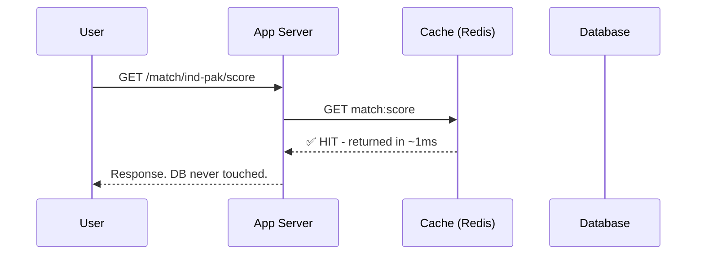

Clean. Whether there are 100 users or 10 million - if the cache holds, the database barely notices.

Now here's what happens when that cache key expires under high traffic:


Thousands of requests - all for the exact same data - hammer the database simultaneously. The DB, built to handle a few hundred queries per second comfortably, gets thousands in a single instant. It buckles.

---

## Normal Spike vs. Thundering Herd

This is the distinction engineers miss most often. Both look like "elevated traffic" on a dashboard. They are completely different problems.

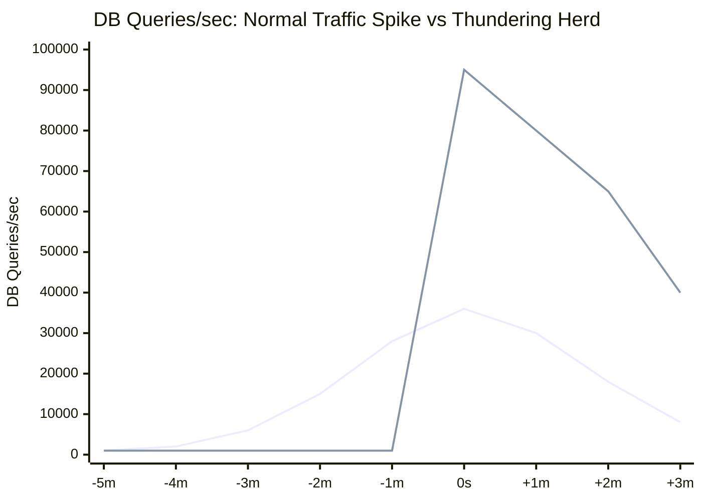

A normal spike builds gradually. Your auto-scaler has time to react. Your cache is still serving most requests. The database sees incremental load it can manage.

A thundering herd goes from baseline to catastrophic **in one second.** Your auto-scaler hasn't even been alerted yet. Your cache is completely empty. Every single request is a DB query. No ramp - just a wall.

| | Normal Spike | Thundering Herd |
|---|---|---|
| **Arrival** | Gradually, over minutes | Instantly, in one second |
| **Cache behaviour** | Mostly hits, some misses | Every single request misses |
| **DB load** | Incremental increase | Instant vertical spike |
| **Auto-scaling** | Has time to respond | Too slow - damage already done |
| **Recovery** | Usually self-correcting | Often needs manual intervention |

---

## Why It Becomes Dangerous - The Death Spiral

One spike is bad. What happens *after* is worse.

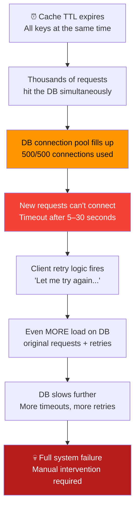

The retry death spiral is what turns "our site was slow for 30 seconds" into "we were down for 2 hours." Every second of failure generates more load than the second before it. The system stops recovering on its own.

---

## The 6 Techniques That Actually Work

### 1. Staggered Expiry (TTL Jitter)

The cheapest fix. Should be the default everywhere.

The problem is that all your keys expire at the same time. So the fix is: don't let them. Add randomness to every TTL so expiries are spread across a window instead of synchronized to the same second.

```js
// ❌ Every key expires at the exact same second
cache.set('match:score', data, 3600)

// ✅ Each key gets a slightly different TTL - expiries spread across ~15 minutes
const jitter = 3600 * (0.10 + Math.random() * 0.15) // 10–25% of base TTL
cache.set('match:score', data, 3600 + jitter)
```

Visually, the difference is stark:

```mermaid
gantt
    title Cache Expiry: No Jitter vs With Jitter
    dateFormat HH:mm
    axisFormat %H:%M
    tickInterval 2m

    section ❌ No Jitter
    user-101         :done, 00:00, 2m
    user-102         :done, 00:00, 2m
    user-103         :done, 00:00, 2m
    user-104         :done, 00:00, 2m
    user-105         :done, 00:00, 2m
    ⚠️ All miss      :crit, 00:00, 16m

    section ✅ Jitter (15m window)
    user-101         :done, 00:02, 2m
    user-104         :done, 00:05, 2m
    user-102         :done, 00:08, 2m
    user-103         :done, 00:12, 2m
    user-105         :done, 00:14, 2m
```

Instead of a vertical wall of DB queries at midnight, you get a gentle slope the database handles comfortably.

**The trap nobody warns you about:** jitter doesn't help if you warm the cache centrally. A warming script that runs at 11 PM and sets all 500K keys with `TTL = 3600` will have all of them expiring around midnight regardless of jitter. You need to anchor TTLs to data freshness - when the data was last updated - not to when you happened to cache it.

**Trade-off:** Some data lives in cache 6–15 minutes longer than strictly necessary. For match scores, product listings, user profiles - completely fine.

---

### 2. Request Coalescing (Mutex / Single-Flight)

Jitter solves the *timing* problem across many different keys. But what about one very popular key? `match:ind-pak:live-score` expires during peak traffic - 50,000 concurrent requests all miss cache at the same time and rush to the DB simultaneously.

The solution: when a key is missing, only let **one** request go to the database. Everyone else waits for that single result and shares it.

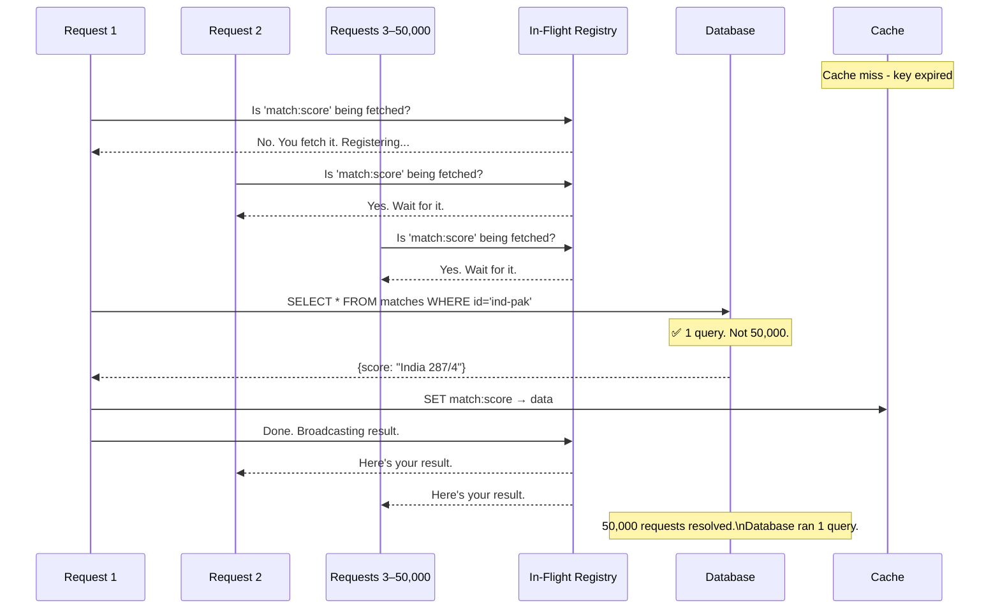

The mechanism is an in-flight registry - a simple map of `key → Promise`. When request 1 misses cache, it creates a Promise for the DB fetch and registers it. Requests 2 through 50,000 find that Promise in the registry and simply await it. The database gets exactly one query. When the result arrives, every waiting request resolves simultaneously.

```js
const inFlight = new Map()

async function getScore(matchId) {
  const cached = await cache.get(matchId)
  if (cached) return cached

  // Already being fetched? Wait for that result instead of hitting DB again
  if (inFlight.has(matchId)) return inFlight.get(matchId)

  // First request - register the promise so others can share it
  const promise = db.fetchScore(matchId)
    .then(data => { cache.set(matchId, data, 30); return data })
    .finally(() => inFlight.delete(matchId)) // always clean up, success or failure

  inFlight.set(matchId, promise)
  return promise
}
```

**The failure case you must handle:** if the DB query fails, remove the in-flight entry immediately - don't leave it registered. If you do, every subsequent request inherits the same failed result and the key never recovers. Always clean up on both success and failure.

Instagram took this a step further: instead of a separate registry, they cache the Promise itself. First miss creates a Promise and stores it in cache. Requests 2 through N find the Promise in cache and await it directly. One DB call, the cache is the coordinator, no extra infrastructure needed.

**Trade-off:** Requests that arrive during a cache miss wait one DB round-trip instead of getting an instant response. For a 50ms query, that's nothing. For a slow query on a struggling DB, you're choosing: wait 3 seconds or get an error? Usually waiting is better.

---

### 3. Stale-While-Revalidate (SWR)

Single-flight still makes some users wait on a cache miss. SWR takes a different philosophy: **never make the user wait at all.** Serve whatever is in cache - even if it's slightly old - and refresh in the background.

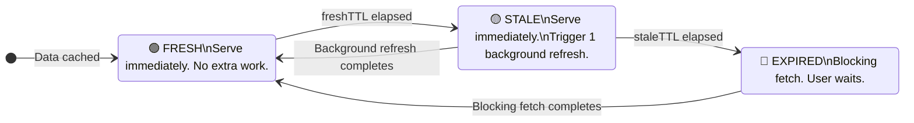

The key idea: instead of one TTL, you manage two.

- **freshTTL** - data is perfectly current, serve it and do nothing else
- **staleTTL** - data is old but still usable, serve it immediately and kick off one background refresh

```js
async function getWithSWR(key, fetchFn, freshTTL = 30, staleTTL = 120) {
  const entry = await cache.get(key)
  const age = entry ? (Date.now() - entry.cachedAt) / 1000 : Infinity

  if (!entry || age > staleTTL) return fetchAndStore(key, fetchFn) // must wait

  if (age > freshTTL) fetchAndStore(key, fetchFn) // refresh quietly in background

  return entry.data // user never waits
}
```

The user always gets a response without waiting. The database gets one refresh query in the background, not one per user.

During a live Hotstar stream, users see the score in under 100ms - always. The data might be 15 seconds old. Nobody notices. At 40 million concurrent viewers, this is the difference between a healthy database and a crater.

**But SWR is not always appropriate:**

| Data | Use SWR? | Why |
|---|---|---|
| Live cricket score | ✅ Yes | 30s lag is invisible to fans |
| Trending content, product listings | ✅ Yes | Slow-changing, staleness acceptable |
| User's account balance | ❌ No | Stale data leads to wrong decisions |
| "Only 2 left in stock" | ❌ No | Stale availability = overselling |
| Auth tokens / permissions | ❌ No | Stale permissions = security hole |

Use SWR where eventual consistency is acceptable. Don't use it where stale data causes real harm.

---

### 4. Probabilistic Early Expiration (PER)

Jitter and SWR still have a blind spot: **one very hot key under extreme traffic.**

Think about it this way. Your cache key expires at 11:00 PM. At 10:59:59, you have 100,000 users reading that key. One second later - it's gone. All 100,000 hit the DB at the same time. You've done everything right, and you still get a thundering herd. Just a punctual one.

PER's answer to this is almost too simple: **refresh the key before it dies, not after.**

Instead of waiting for the TTL to run out, each incoming request quietly asks - *is this entry old enough that I should go refresh it in the background?* When the entry is fresh, the answer is almost always no. But as it ages and gets closer to expiry, the answer becomes more and more likely to be yes. Eventually, one request wins that coin flip, kicks off a background refresh, and the key gets a new TTL - while everyone else keeps reading the old value without waiting at all.

The key word is *probabilistic*. The refresh doesn't happen at a fixed age. It happens randomly, weighted by how old the entry is. This is what makes it work - if it refreshed at a fixed threshold like "80% of TTL consumed", every single request hitting at that threshold would trigger a refresh simultaneously. Same problem, earlier timestamp. Randomness is what breaks the synchronization.

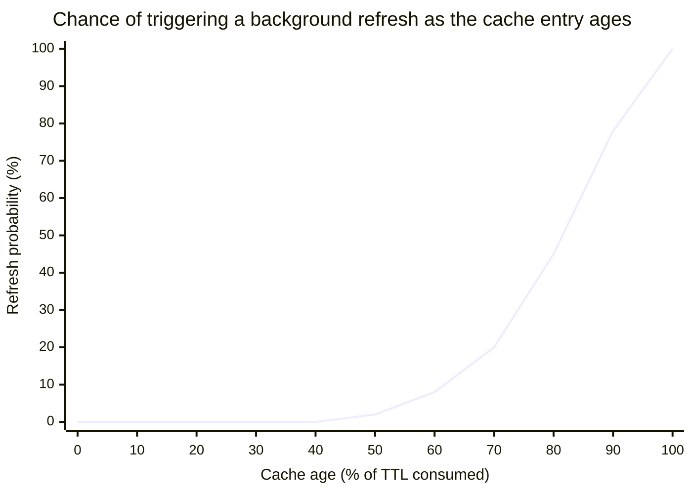

```js
async function getWithPER(key, fetchFn, ttl = 60) {
  const entry = await cache.get(key)
  if (!entry) return fetchAndStore(key, fetchFn, ttl)

  const age = (Date.now() - entry.cachedAt) / 1000
  const refreshProbability = Math.max(0, (age / ttl - 0.5) * 2) // 0% for first half, ramps to 100% by expiry

  if (Math.random() < refreshProbability) {
    fetchAndStore(key, fetchFn, ttl) // background refresh - user gets cached data regardless
  }

  return entry.data
}
```

In practice: somewhere in the last 20–30% of the TTL window, one request triggers a quiet background refresh. The key never actually expires under traffic. The DB gets one query. All 100,000 users got served without waiting.

**Trade-off:** A few requests near the end of a TTL window trigger a background refresh that wasn't strictly necessary. At scale, a handful of extra DB queries is a price you'll happily pay.

---

### 5. Exponential Backoff with Jitter (Retry Logic)

This one is different from the rest. It's not about preventing the thundering herd - it's about stopping your retry logic from **creating a second one** while you're still recovering from the first.

Here's what happens. Your DB gets overwhelmed. Requests start timing out. Every client has retry logic - so naturally, they all try again. If that retry is set to a fixed interval, say "wait 1 second and try again," here's the problem: they all failed at the same time. So they all retry at the same time. Your DB, which was just starting to breathe, gets hit with the exact same wave again. And again. And again - once per second, like clockwork, until someone manually intervenes.

You didn't have one thundering herd. You accidentally scheduled ten of them back to back.

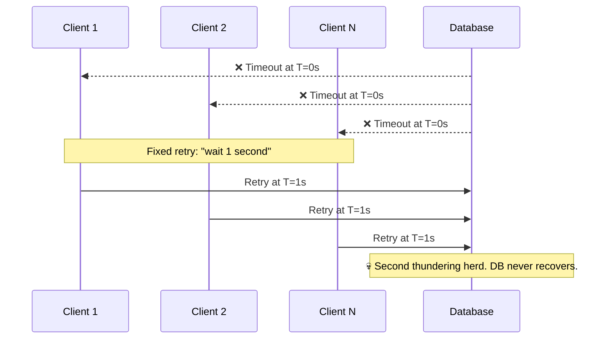

The fix has two parts working together.

**Exponential backoff** means each failed attempt waits longer than the last - 200ms, then 400ms, then 800ms, then 1600ms. This gives the DB progressively more breathing room with each retry wave instead of hammering it every second.

**Jitter** adds a small random offset to each wait. So instead of every client retrying at exactly T=1s, one retries at 820ms, another at 1.1s, another at 1.4s. They naturally spread out. What was a synchronized wall becomes a trickle the DB can handle.

```js
for (let attempt = 0; attempt < maxRetries; attempt++) {
  try { return await fetch() } catch {}
  const base = 200 * Math.pow(2, attempt)         // 200 → 400 → 800 → 1600ms
  await sleep(base + Math.random() * base * 0.5)  // + random 0–50% on top
}
```

```mermaid
gantt
    title Retry Timing: Fixed Interval vs Exponential Backoff with Jitter
    dateFormat s
    axisFormat %S
    tickInterval 1s

    section ❌ Fixed interval
    Client 1 retry      :crit, 1, 1s
    Client 2 retry      :crit, 1, 1s
    Client 3 retry      :crit, 1, 1s
    Second herd         :crit, 1, 3s

    section ✅ Exp + Jitter
    Client 1 retry 1      :done, 0, 1s
    Client 2 retry 1      :done, 1, 1s
    Client 3 retry 1      :done, 2, 1s
    Client 1 retry 2      :done, 2, 1s
    Client 2 retry 2      :done, 3, 1s
```

Braintree (PayPal's payment processor) traced a major outage to exactly this. Failed jobs retrying on fixed intervals, stacking perfectly on top of new traffic, overwhelming their services every N seconds like clockwork. Adding jitter broke the synchronization. Problem disappeared.

---

### 6. Cache Warming

The most powerful technique is making sure the cache is never empty when traffic arrives. If you can predict when a spike is coming, pre-load the cache before it hits.

This is the only proactive technique in this list. Everything else is reactive - it handles cache misses gracefully. Cache warming eliminates the miss entirely.

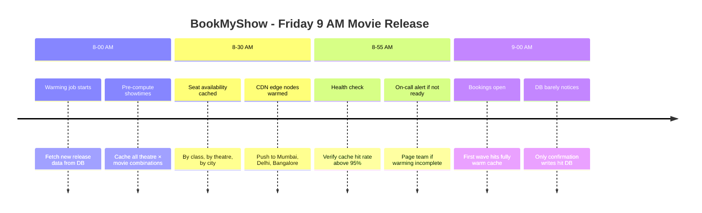

```js
// Run 30 minutes before the event - in small batches, not all at once
for (let i = 0; i < hotKeys.length; i += 50) {
  const batch = hotKeys.slice(i, i + 50)
  await Promise.all(batch.map(async ({ key, fetch, ttl }) => {
    const data = await fetch()
    const jitter = ttl * (0.05 + Math.random() * 0.10) // don't let warmed keys all expire together either
    cache.set(key, data, ttl + jitter)
  }))
  await sleep(200) // breathe between batches - don't DDoS your own DB
}
```

**The trap that kills warming jobs:** fetching 100K keys in parallel to warm the cache is itself a thundering herd - you've just aimed it at your own DB from the inside. Always fetch in small batches with a pause between each batch.

Also: always add jitter to warmed keys. If every key gets `TTL = 3600` during warming and warming ran at 8 PM, they all expire at 9 PM. You've just moved the thundering herd one hour into the future.

IRCTC does this before every 10 AM Tatkal window - train schedules, fares, quotas all pre-loaded by 9:45 AM. And yet they still struggle at exactly 10 AM. Because seat booking *writes* also spike simultaneously, and caching can't help with writes. That's a different problem entirely: distributed locking and optimistic concurrency control.

---

## How These Layer Together

No single technique covers everything. In production, you combine them:

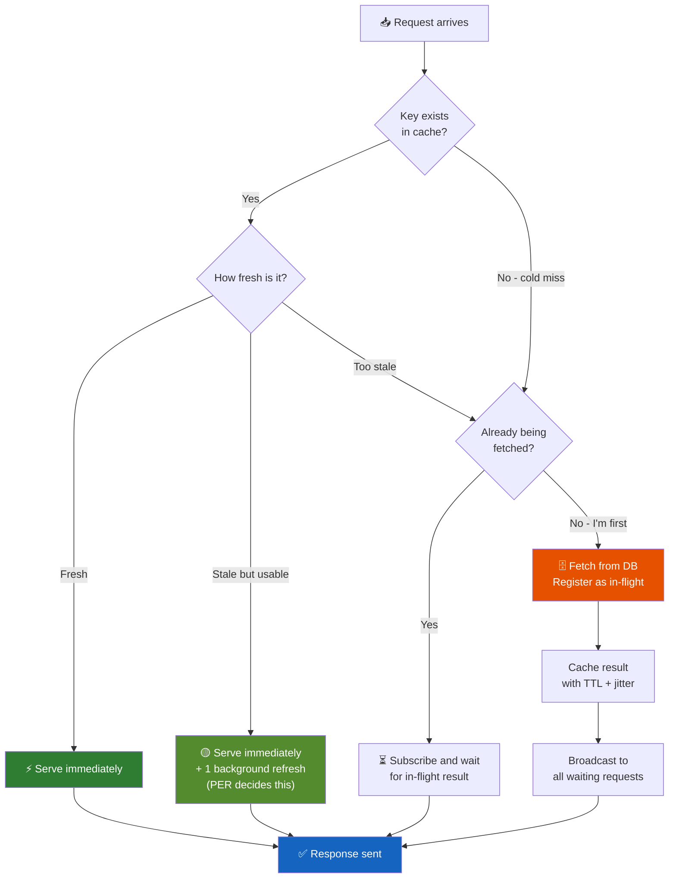

The combinations in practice:

| Scenario | Techniques |
|---|---|
| Known event (IPL, product launch) | Cache warming + Jitter on all warmed keys |
| Live score, trending feed | SWR + PER + Single-flight |
| Unpredictable traffic, fresh data required | Single-flight + Jitter |
| System already struggling, retries firing | Exponential backoff + Circuit breaker |

You don't need all six everywhere. A live match score needs SWR + PER + single-flight. A product listing needs jitter + warming. An auth token shouldn't be cached at all.

---

## Real Incidents Worth Learning From

**Instagram** - Instead of caching the *result* of a DB query, they cache the *Promise* representing it. First miss creates a Promise and stores it in cache. Every other request finds the Promise and awaits it. One DB query. Zero extra coordination. The cache itself is the synchronization mechanism.

**IRCTC - The 10:00:00 AM Wall** - Tatkal booking opens at exactly 10 AM. Millions refresh simultaneously. Seats are scarce. IRCTC pre-warms train and fare data from 9:45 AM, runs quota logic on in-memory data structures, uses circuit breakers on writes. And they still struggle - because booking *confirmation writes* spike at 10 AM and caching can't help you there. Different problem. Different solution.

---

## Further Reading

- [Instagram Engineering: Thundering Herds & Promises](https://instagram-engineering.com/thundering-herds-promises-82191c8af57d) - The Promise-caching approach, by the people who built it
- [Netflix Tech Blog: Caching for a Global Netflix](https://netflixtechblog.com/caching-for-a-global-netflix-7bcc457012f1) - How they handle cold caches when traffic shifts between regions
- [Braintree/PayPal: Fixing the Retry Storm](https://www.infoq.com/news/2022/05/braintree-thundering-herd/) - Real incident, real fix with backoff + jitter
- [Go's `singleflight` package](https://pkg.go.dev/golang.org/x/sync/singleflight) - Worth reading even if you don't write Go. The abstraction is clean and instructive.
- [XFetch Paper: Probabilistic Cache Stampede Prevention](https://cseweb.ucsd.edu/~avattani/papers/cache_stampede.pdf) - The math behind PER if you want to go deep