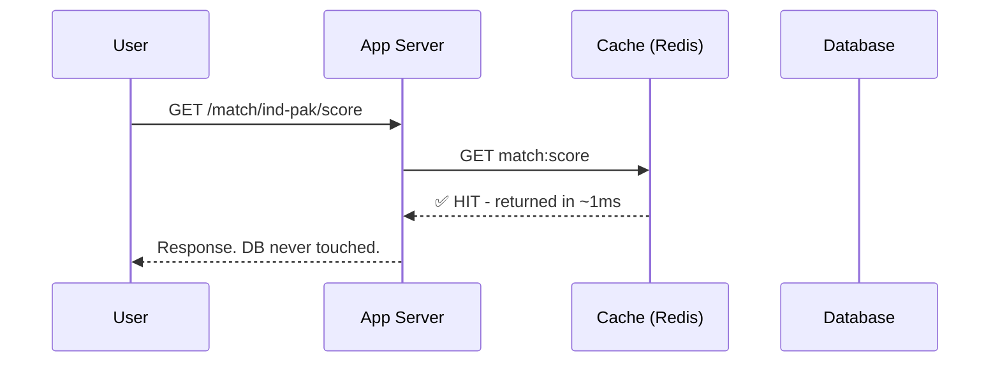
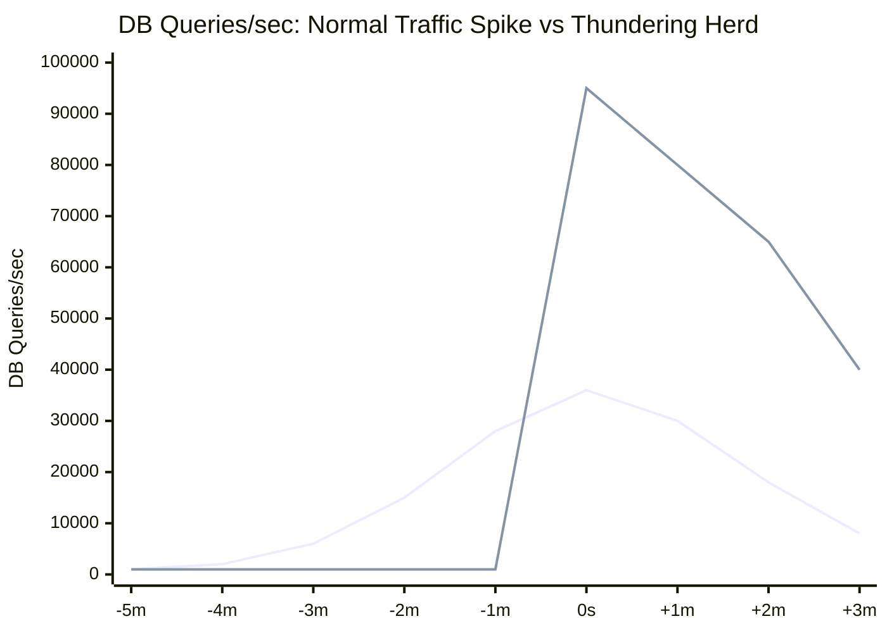
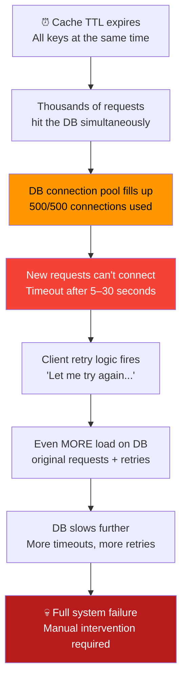
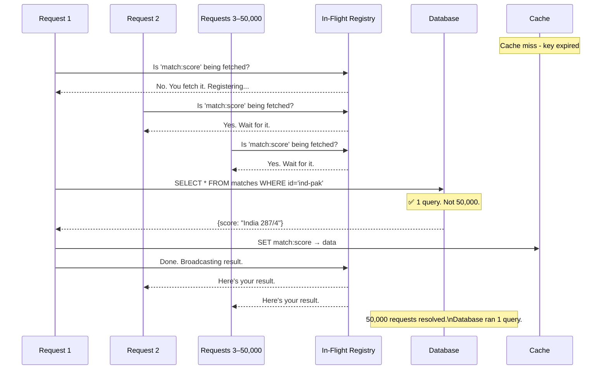
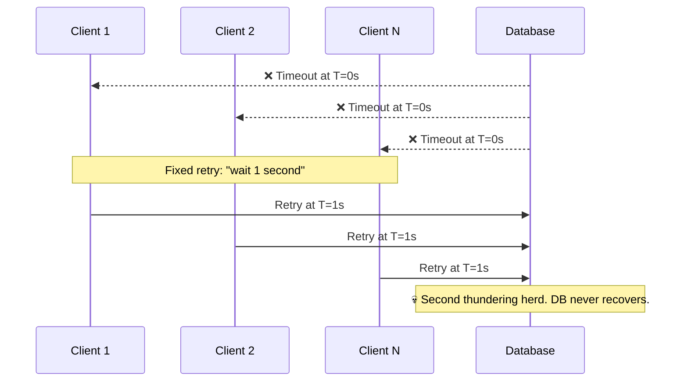
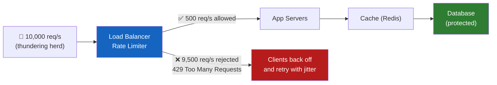
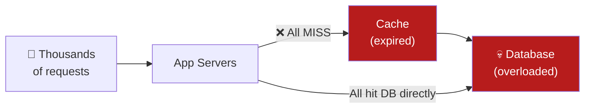
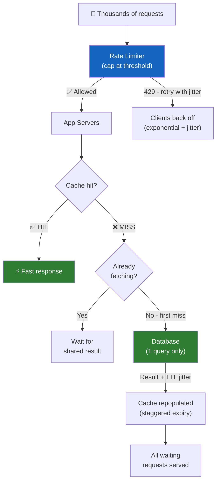

## Analogy: The Store Rush

Before we touch anything technical, let me paint you a picture.

A popular electronics store announces a massive sale - everything 70% off, starting at 10:00 AM sharp. By 9:59 AM, 2,000 people are pressed against the glass doors. The guard unlocks them at exactly 10:00:00.

What happens? Everyone rushes in at once. The billing counters - designed for maybe 50 customers at a time - are instantly overwhelmed. Staff can't help anyone. Payment systems crawl. Some people give up and leave. The whole experience collapses. Not because the store was bad. Because **the entire load arrived in the same second.**

Now map that to your system:

| Store analogy | System reality |
|---|---|
| The store | Your database |
| Billing counters | DB connection pool |
| Customers | Concurrent requests |
| Guard opening the door | Your cache TTL expiring |

That's the thundering herd. Not too much traffic - too much traffic arriving **at the exact same moment**, with nothing to absorb it.

---

## What This Looks Like in a Real System

Most web apps follow this architecture:

```
User → App Server → Cache (Redis) → Database (PostgreSQL)
```

The cache is the middleman. It holds frequently-read data so the database barely gets touched. Here's the happy path:



Clean. Whether there are 100 users or 10 million - if the cache holds, the database barely notices.

Now here's what happens when that cache key expires under high traffic:


Thousands of requests - all for the exact same data - hammer the database simultaneously. The DB, built to handle a few hundred queries per second comfortably, gets thousands in a single instant. It buckles.

---

## Normal Spike vs. Thundering Herd

This is the distinction engineers miss most often. Both look like "elevated traffic" on a dashboard. They are completely different problems.



A normal spike builds gradually. Your auto-scaler has time to react. Your cache is still serving most requests. The database sees incremental load it can manage.

A thundering herd goes from baseline to catastrophic **in one second.** Your auto-scaler hasn't even been alerted yet. Your cache is completely empty. Every single request is a DB query. No ramp - just a wall.

| | Normal Spike | Thundering Herd |
|---|---|---|
| **Arrival** | Gradually, over minutes | Instantly, in one second |
| **Cache behaviour** | Mostly hits, some misses | Every single request misses |
| **DB load** | Incremental increase | Instant vertical spike |
| **Auto-scaling** | Has time to respond | Too slow - damage already done |
| **Recovery** | Usually self-correcting | Often needs manual intervention |

---

## Why It Becomes Dangerous - The Death Spiral

One spike is bad. What happens *after* is worse.



The retry death spiral is what turns "our site was slow for 30 seconds" into "we were down for 2 hours." Every second of failure generates more load than the second before it. The system stops recovering on its own.

---

## Impact - What's Actually Breaking

When a thundering herd hits, the damage isn't random. It follows a predictable pattern across every layer of your stack.

_**CPU**_ - the database CPU is the first thing to spike. Normally, most queries hit the buffer pool (data cached in memory) and return fast. When thousands of identical queries arrive simultaneously, they all miss the buffer pool, go to disk, and compete for the same CPU cycles. What's usually 5% CPU becomes 100% in seconds - before any other metric has even moved.

_**Database**_ - connection pool exhaustion is what finishes it off. Most databases cap at 200–500 connections. When all slots are occupied by in-flight queries, every new request queues. Queries that normally take 5ms now take 8 seconds because they spent 7.9 seconds just waiting for a free connection slot.

_**Cache**_ - didn't fail. It did exactly what it was told. But now it's being hammered with thousands of simultaneous writes as every app server races to repopulate the same keys at once, adding write pressure on top of the read storm.

_**App Servers**_ - threads block waiting for DB responses that aren't coming. Thread pools fill. Memory climbs. Servers start dying from OOM errors, get pulled from the load balancer, and push their load onto the surviving servers - which accelerates the collapse.

_**Latency**_ - P50 (what most users experience) looks almost normal at first since some requests still hit warm cache on other keys. But P99 goes from 200ms to 30 seconds instantly. As the cascade deepens, P50 catches up to P99. By that point, everyone is affected.

---

## Where This Commonly Occurs

Caching is the obvious trigger, but not the only one.

_**Cache TTL expiry**_ - the most common cause. A key expires under high traffic and every server rushes to rebuild it simultaneously. This is what the diagrams above show.

_**Scheduled jobs**_ - 500 background workers all fire at midnight. They hit the same tables, fight for the same connections. A thundering herd with zero users involved - your own infrastructure hammering itself.

_**Cold cache after deploy**_ - new servers spin up with empty local caches. If multiple servers restart simultaneously, every request they receive is a miss. You've built a thundering herd into your deploy pipeline.

_**Reconnect storms**_ - your WebSocket server restarts. Every connected client tries to reconnect at the same moment. Without jitter in the client retry logic, you're sending a synchronized burst to a server that just came back online.

_**Load balancer recovery**_ - a server flaps back online after a health check failure. The balancer starts routing traffic to it. Its cache is cold. All incoming traffic is a miss until it warms up.

The thread connecting all of them: **synchronized behaviour in distributed systems is almost always dangerous.** When many things wake up at the same moment and reach for the same resource - that's where systems break.

---

## Techniques to Prevent It

### 1. Staggered Expiry (TTL Jitter)

The cheapest fix. Should be the default everywhere.

The problem is that all your keys expire at the same time. The fix: don't let them. Add randomness to every TTL so expiries are spread across a window instead of synchronized to the same second.

```js
// ❌ Every key expires at the exact same second
cache.set('match:score', data, 3600)

// ✅ Each key gets a slightly different TTL - expiries spread across ~15 minutes
const jitter = 3600 * (0.10 + Math.random() * 0.15) // 10–25% of base TTL
cache.set('match:score', data, 3600 + jitter)
```

Visually, the difference is stark:

```text
Time (min) | 00   02   04   06   08   10   12   14   16
---------------------------------------------------------
❌ No Jitter (All expire at 00:00)
user-101   |[X]
user-102   |[X]
user-103   |[X]
user-104   |[X]
           | ⚠️ All miss simultaneously! DB stampede.

✅ With Jitter (Expiries spread over 15 mins)
user-101   |    [X]
user-104   |         [X]
user-102   |              [X]
user-103   |                        [X]
user-105   |                                  [X]
           | ✅ DB handles gradual misses comfortably.
```

Instead of a vertical wall of DB queries at midnight, you get a gentle slope the database handles comfortably.

**Trade-off:** Some data lives in cache 6–15 minutes longer than strictly necessary. For most use cases - completely fine.

---

### 2. Request Coalescing (Mutex / Single-Flight)

Jitter spreads expiries across different keys. But what about one very popular key? `match:ind-pak:live-score` expires during peak traffic - 50,000 concurrent requests all miss cache at the same time.

The solution: when a key is missing, only let **one** request go to the database. Everyone else waits for that single result and shares it.



The mechanism is an in-flight registry - a simple map of `key → Promise`. When request 1 misses cache, it creates a Promise for the DB fetch and registers it. Requests 2 through 50,000 find that Promise in the registry and simply await it. The database gets exactly one query. When the result arrives, every waiting request resolves simultaneously.

```js
const inFlight = new Map()

async function getScore(matchId) {
  const cached = await cache.get(matchId)
  if (cached) return cached

  if (inFlight.has(matchId)) return inFlight.get(matchId)

  const promise = db.fetchScore(matchId)
    .then(data => { cache.set(matchId, data, 30); return data })
    .finally(() => inFlight.delete(matchId)) // clean up on success or failure

  inFlight.set(matchId, promise)
  return promise
}
```

_**The failure case you must handle:**_ if the DB query fails, the `.finally()` block removes the in-flight entry immediately. If you skip this, every subsequent request inherits the same failed Promise and the key never recovers.

Instagram took this a step further: instead of a separate registry, they cache the Promise itself. First miss creates a Promise and stores it in cache. Requests 2 through N find the Promise in cache and await it directly. One DB call, zero extra infrastructure.

_**Trade-off:**_ Requests that arrive during a cache miss wait one DB round-trip. For a 50ms query, that's nothing. For a slow query on a struggling DB, waiting beats getting an error.

---

### 3. Exponential Backoff with Jitter (Retry Logic)

This one is different from the rest. It's not about preventing the thundering herd - it's about stopping your retry logic from **creating a second one** while you're still recovering from the first.

Here's what happens. Your DB gets overwhelmed. Requests start timing out. Every client has retry logic - so they all try again. If that retry is fixed at "wait 1 second", here's the problem: they all failed at the same time, so they all retry at the same time. Your DB, which was just starting to breathe, gets hit with the exact same wave again. And again. Once per second, like clockwork, until someone manually intervenes.

You didn't have one thundering herd. You accidentally scheduled ten of them back to back.



The fix has two parts working together.

**Exponential backoff** means each failed attempt waits longer than the last - 200ms, then 400ms, then 800ms, then 1600ms. This gives the DB progressively more breathing room instead of hammering it every second.

**Jitter** adds a small random offset to each wait. So instead of every client retrying at exactly T=1s, one retries at 820ms, another at 1.1s, another at 1.4s. What was a synchronized wall becomes a trickle the DB can handle.

```js
for (let attempt = 0; attempt < maxRetries; attempt++) {
  try { return await fetch() } catch {}
  const base = 200 * Math.pow(2, attempt)         // 200 → 400 → 800 → 1600ms
  await sleep(base + Math.random() * base * 0.5)  // + random 0–50% on top
}
```

```text
Time (sec) | 0.0    0.5    1.0    1.5    2.0    2.5    3.0    3.5
------------------------------------------------------------------
❌ Fixed 1s interval 
Client 1   |               [Retry]
Client 2   |               [Retry]
Client 3   |               [Retry]
           |               ⚠️ Second herd forms exactly at 1.0s

✅ Exponential Backoff + Jitter
Client 1   |           [R1]                        [R2]
Client 2   |                  [R1]                                [R2]
Client 3   |                                [R1]
           | ✅ Retries are scattered. DB is protected.
```

Braintree (PayPal's payment processor) traced a major outage to exactly this. Failed jobs retrying on fixed intervals, stacking perfectly on top of new traffic, overwhelming their services every N seconds like clockwork. Adding jitter broke the synchronization. Problem disappeared.

---

### 4. Rate Limiting

The three techniques above spread load out. Rate limiting does the opposite - it puts a hard ceiling on how much load ever reaches your backend in the first place.

When a thundering herd hits, your DB doesn't fail because the requests are illegitimate. It fails because there are too many of them at once. Rate limiting at the edge - on your API gateway or load balancer - means you decide how many requests per second your backend will accept. Everything above that threshold gets rejected with a `429 Too Many Requests` before it ever touches your cache or DB.



**Rate limiting alone doesn't prevent the thundering herd** - it just caps the blast radius. The herd still arrives; you're turning it away at the door rather than letting it flood the DB. The clients that get rejected need exponential backoff with jitter (technique 3) so they don't immediately form another synchronized retry wave.

The two most common algorithms:

_**Token bucket**_ - a bucket refills at a fixed rate (say, 500 tokens/second). Each request consumes one token. When the bucket is empty, requests are rejected. Short bursts above the rate are absorbed as long as tokens are available. Good for APIs that need to tolerate occasional spikes without dropping them.

_**Sliding window**_ - count requests across a rolling time window. If the count exceeds the limit, reject until the window moves forward. More accurate than a fixed window, which can be gamed by sending traffic right at the boundary of two windows.

Rate limiting is the last line of defense - not the first. You still want jitter and single-flight in place. But if something unexpected causes a stampede those techniques don't catch, the rate limiter is what stops your database from receiving 10,000 simultaneous connections.

---

## Before vs After: What Protection Looks Like

Without any mitigation, a cache miss under high traffic goes straight to DB stampede:



With techniques layered together:



Every layer has a job. Rate limiter caps volume. Single-flight ensures one DB query per miss. Jitter prevents the next synchronized expiry. Backoff with jitter prevents retry storms from forming.

---

## Real Incidents Worth Learning From

**Facebook 2010** - A bad config value propagated through every layer of their Memcached infrastructure. Every cache lookup failed simultaneously. Hundreds of millions of requests hit a database never designed for direct traffic at that scale. Their fix: **lease tokens** - when a cache miss fires, the server issues a lease to exactly one request to fetch from DB. All others wait for the leaseholder. Single-flight, at the cache infrastructure level.

**Instagram** - Instead of caching the *result* of a DB query, they cache the *Promise* representing it. First miss creates a Promise and stores it in cache. Every subsequent request finds the Promise and awaits it. One DB query. Zero extra coordination. The cache is the synchronization mechanism.

**IRCTC - The 10:00:00 AM Wall** - Tatkal booking opens at exactly 10 AM. Millions refresh simultaneously. IRCTC pre-warms train and fare data by 9:45 AM and uses circuit breakers on writes. And they still struggle - because booking *confirmation writes* also spike at 10 AM, and caching can't help with writes. That's a different problem: distributed locking and optimistic concurrency control.

**Braintree** - Failed jobs retrying on fixed intervals stacked perfectly on top of new traffic, overwhelming services every N seconds like clockwork. Adding jitter to retry logic broke the synchronization. The outage stopped.


---

## Further Reading
- [Caching Strategies to Prevent Thundering Herd](https://gsavitha.in/posts/caching-strategies/) - SWR, probabilistic early expiration, cache warming and more - techniques that pick up where this post leaves off
  
- [Instagram Engineering: Thundering Herds & Promises](https://instagram-engineering.com/thundering-herds-promises-82191c8af57d) - The Promise-caching approach, by the people who built it
- [Braintree/PayPal: Fixing the Retry Storm](https://www.infoq.com/news/2022/05/braintree-thundering-herd/) - Real incident, real fix with backoff + jitter
- [Go's `singleflight` package](https://pkg.go.dev/golang.org/x/sync/singleflight) - Worth reading even if you don't write Go. The abstraction is clean and instructive.
- [AWS: Exponential Backoff and Jitter](https://aws.amazon.com/blogs/architecture/exponential-backoff-and-jitter/) - Practical guidance with benchmarks from AWS engineers
