# The Thundering Herd: When Your Cache Becomes Your Enemy

It's 11:59 PM. India vs Pakistan is about to stream live on Hotstar. 40 million people are staring at their phones, finger on the refresh button. Your Redis cache is set to expire at exactly midnight.

At 12:00:00 AM - every one of those requests hits your server at the same moment. Your cache is empty. Your database never saw it coming.

That's the Thundering Herd. And it's not a hypothetical. IRCTC, Facebook, Netflix - they've all been there. If you build systems at any kind of scale, you will be too.

---

## Start Here: The Store Rush

Before we touch a single line of code, let me paint you a picture.

A popular electronics store announces a massive sale: **everything 70% off, starting at 10:00 AM sharp.** By 9:59 AM, 2,000 people are pressed against the glass doors. The guard unlocks them at exactly 10:00:00.

What happens?

Everyone rushes in at once. The billing counters - designed for maybe 50 customers at a time - are instantly overwhelmed. Staff can't help anyone. The payment systems crawl. Some people give up and leave. The whole experience collapses.

Not because the store was bad. Because **the entire load arrived in the same second.**

Now replace:

| Store analogy | System reality |
|---|---|
| The store | Your database |
| Billing counters | DB connection pool |
| Customers | Concurrent requests |
| Guard opening the door | Your cache TTL expiring |

That's it. The thundering herd isn't about too much traffic - it's about too much traffic arriving **at the exact same moment**, with nothing to absorb it.

---

## What This Looks Like in a Real System

Most web applications have a simple architecture:

```
User → App Server → Cache (Redis) → Database (PostgreSQL)
```

The cache is the middleman. It holds frequently-read data so requests almost never need to touch the database. It works beautifully - until it doesn't.

Here's the happy path when the cache is healthy:

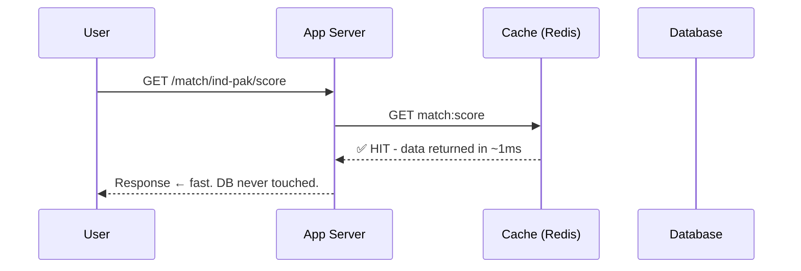

Clean. Fast. The database is completely unbothered. Whether there are 100 users or 10 million, if the cache holds, the DB barely notices.

Now here's what happens when that cache key expires and traffic is high:

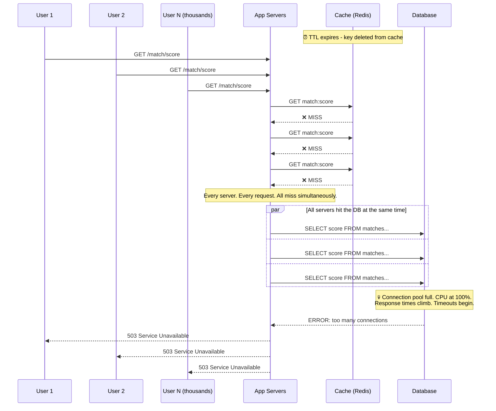

The cache expired. Nobody was ready. Thousands of requests - all for the same data - hit the database at the same instant. The DB, designed for a few hundred queries per second, gets thousands. It buckles.

---

## Normal Spike vs. Thundering Herd

This is the distinction that trips engineers up most often. They look the same on a high-level traffic dashboard but are completely different problems.

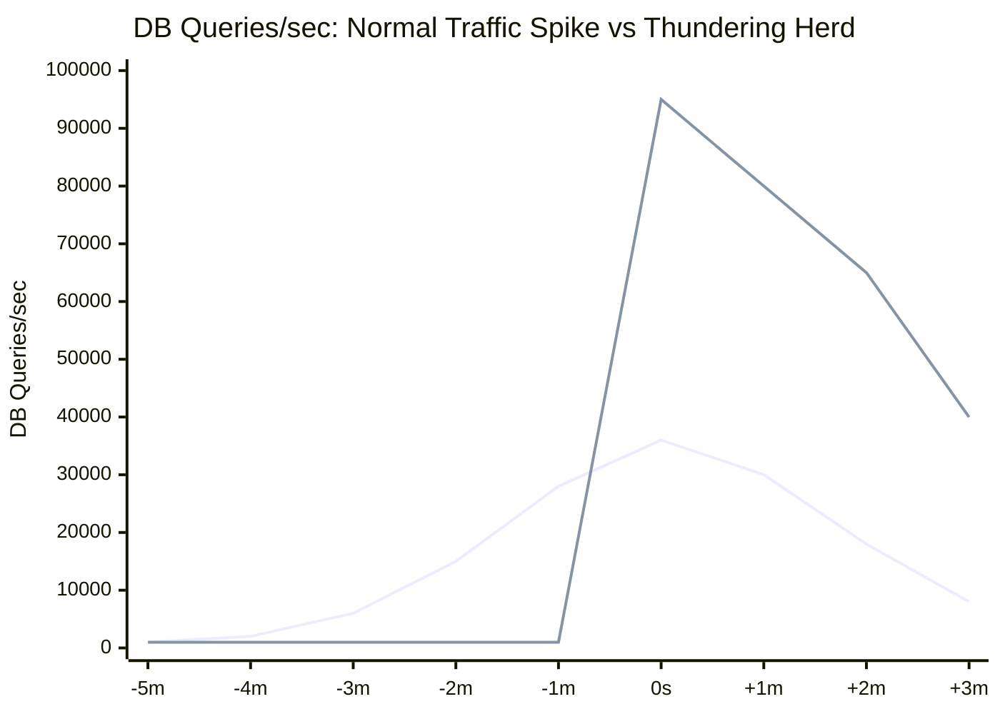

A normal spike **builds gradually**. Your auto-scaler has time to spin up instances. Your cache is still serving most traffic. The database sees incremental load it can handle.

A thundering herd goes from **baseline to catastrophic in literally one second.** Your auto-scaler hasn't even been alerted yet. Your cache is empty. Every single request is a DB query. No ramp - just a wall.

| | Normal Spike | Thundering Herd |
|---|---|---|
| **Arrival** | Gradually, over minutes | Instantly, in one second |
| **Cache behaviour** | Mostly hits, some misses | Every single request misses |
| **DB load** | Incremental increase | Instant vertical spike |
| **Auto-scaling** | Has time to respond | Too slow - damage is already done |
| **Recovery** | Usually self-correcting | Often needs manual intervention |

The sneaky part: on a high-level ops dashboard, both look like "elevated traffic." By the time you're looking at per-cache-key miss rates, the database is already struggling.

---

## Why It Becomes Dangerous - The Death Spiral

One spike is bad. But what happens next is worse.

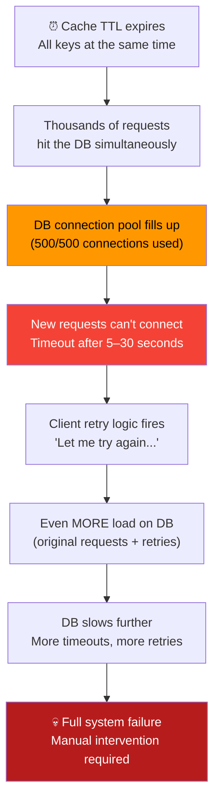

The retry death spiral is what turns "our site was slow for 30 seconds" into "we were down for 2 hours." The system stops recovering on its own because every second of failure generates more load than the second before it. Without someone cutting off the retries or restoring cache manually, it doesn't self-heal.


---

## The 6 Techniques That Actually Work

### 1. Staggered Expiry (TTL Jitter)

The cheapest fix, and should be the default everywhere.

The root cause is simple: all your keys expire at the same time. The fix is equally simple: don't let them. Add a random window to every TTL so expiries are spread out instead of synchronized.

```javascript
// ❌ Dangerous - all keys with the same TTL expire at the same second
cache.set('match:score', data, 3600)

// ✅ Safe - 10–25% random jitter spreads expiry across a window
function setWithJitter(key, data, baseTTL) {
  const jitter = baseTTL * (0.10 + Math.random() * 0.15)
  cache.set(key, data, Math.floor(baseTTL + jitter))
}

setWithJitter('match:score', data, 3600)
// This key expires somewhere between 1h 06m and 1h 15m
// Every key gets a different number - no two expire at exactly the same time
```

Visually, the difference looks like this:

```mermaid
gantt
    title Cache Expiry: No Jitter vs With Jitter
    dateFormat HH:mm
    axisFormat %H:%M

    section ❌ No Jitter - all expire at midnight
    key user-101     :done, 00:00, 1m
    key user-102     :done, 00:00, 1m
    key user-103     :done, 00:00, 1m
    key user-104     :done, 00:00, 1m
    key user-105     :done, 00:00, 1m
    ⚠️ All miss simultaneously :crit, 00:00, 15m

    section ✅ With Jitter - spread over ~15 minutes
    key user-101     :done, 00:02, 1m
    key user-102     :done, 00:08, 1m
    key user-103     :done, 00:12, 1m
    key user-104     :done, 00:05, 1m
    key user-105     :done, 00:14, 1m
```

Instead of a vertical wall of DB queries at midnight, you get a gentle slope. The database handles each miss comfortably.

**The trap nobody warns you about:** jitter doesn't help if you warm the cache centrally. If a warming script runs at 11 PM and sets all 500K keys with `TTL = 3600`, they all expire around midnight anyway. Jitter only works if you anchor TTLs to data freshness, not to when you cached it.

**Trade-off:** Some data stays in cache 6–15 minutes longer than strictly necessary. For user profiles, product listings, match scores - completely fine.

---

### 2. Request Coalescing (Mutex / Single-Flight)

Jitter handles the *timing* problem across many different keys. But what about one very popular key? Say `match:ind-pak:live-score` expires during peak traffic - 50,000 concurrent requests all miss cache at the same time and rush to the DB.

The fix: only let **one** of them actually go to the database. Everyone else waits for that single result.

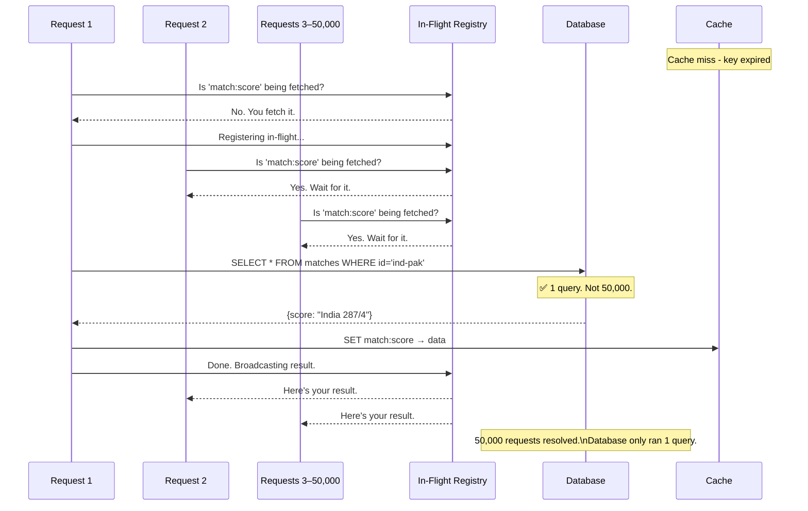

```javascript
class SingleFlight {
  constructor() {
    this.inFlight = new Map()
  }

  async execute(key, fetchFn) {
    // If someone's already fetching this key, wait for their result
    if (this.inFlight.has(key)) {
      return await this.inFlight.get(key)
    }

    // First one here - register the fetch so others can share it
    const promise = fetchFn()
      .finally(() => this.inFlight.delete(key))  // always clean up

    this.inFlight.set(key, promise)
    return await promise
  }
}

const singleFlight = new SingleFlight()

async function getMatchScore(matchId) {
  const cached = await cache.get(`match:${matchId}:score`)
  if (cached) return cached

  // 50,000 concurrent calls here → only 1 DB query runs
  return await singleFlight.execute(`match:${matchId}:score`, async () => {
    const data = await db.query('SELECT * FROM matches WHERE id = $1', [matchId])
    await cache.set(`match:${matchId}:score`, data, 30)
    return data
  })
}
```

**The failure case you must handle:** If the DB query fails and you don't clean up the registry entry, every subsequent request inherits the same failed Promise - and they all fail forever. The `.finally()` above handles this. Remove the entry whether the fetch succeeded or failed, so the next request can retry.

**Trade-off:** Requests wait one full DB round-trip on a cache miss. For a 50ms query, that's nothing. For a 3-second query on an already struggling DB, it's a decision: is waiting 3 seconds better than returning an error? Usually yes.

Instagram solved this elegantly: instead of caching the *result* of a DB query, they cache the *Promise* itself. First miss creates a Promise and stores it in cache. Every subsequent request finds the Promise and just awaits it. One DB call. No separate registry needed - the cache *is* the coordinator.

---

### 3. Stale-While-Revalidate (SWR)

Single-flight still makes some users wait on a cache miss. SWR takes a different philosophy entirely: **never make the user wait.** Serve whatever you have in cache - even if it's old - and refresh in the background.


You manage two TTL values instead of one:

- **freshTTL** - data is perfectly current, just serve it, do nothing else
- **staleTTL** - data is old but usable, serve it immediately while refreshing quietly in the background

```javascript
class SWRCache {
  constructor(cache) {
    this.cache = cache
    this.refreshing = new Set()
  }

  async get(key, fetchFn, { freshTTL = 30, staleTTL = 120 } = {}) {
    const entry = await this.cache.get(key)
    const age = entry ? (Date.now() - entry.cachedAt) / 1000 : Infinity

    if (!entry || age > staleTTL) {
      // Nothing usable in cache - user has to wait for a fresh fetch
      return this.fetchAndStore(key, fetchFn, staleTTL)
    }

    if (age > freshTTL && !this.refreshing.has(key)) {
      // Data is stale but usable - return it immediately
      // Kick off one background refresh so the next request gets fresh data
      this.refreshing.add(key)
      this.fetchAndStore(key, fetchFn, staleTTL)
        .finally(() => this.refreshing.delete(key))
    }

    return entry.data  // user gets a response immediately, no waiting
  }

  async fetchAndStore(key, fetchFn, staleTTL) {
    const data = await fetchFn()
    await this.cache.set(key, { data, cachedAt: Date.now() }, staleTTL)
    return data
  }
}

// Match score: fresh for 10s, still usable for 60s
const score = await swr.get(
  'match:ind-pak:score',
  () => db.getScore('ind-pak'),
  { freshTTL: 10, staleTTL: 60 }
)
```

During a live Hotstar stream, users see the score page in under 100ms - always. The background process updates the cache every 10 seconds. At 40 million concurrent viewers, that's the difference between a healthy database and a fire.

**But SWR is not always the right call:**

| Data | Use SWR? | Why |
|---|---|---|
| Live cricket score | ✅ Yes | 30s lag is invisible to fans |
| Trending content list | ✅ Yes | "Yesterday's trending" is still useful |
| Product listing, prices | ✅ Yes | Prices change slowly |
| **User's account balance** | ❌ No | Stale data leads to wrong decisions |
| **"Only 2 left in stock"** | ❌ No | Stale availability = overselling |
| **Auth tokens / permissions** | ❌ No | Stale permissions = security hole |

Use SWR where eventual consistency is acceptable. Don't use it where stale data causes real-world harm.

---

### 4. Probabilistic Early Expiration (PER)

Jitter prevents synchronized mass expiry. SWR keeps users from waiting. But both still have a blind spot: **very popular keys under high traffic.**

Imagine `match:ind-pak:live-score` has a 60-second TTL. At second 59, you have 100,000 concurrent requests - all reading stale-but-usable data via SWR. At second 61, the `staleTTL` runs out. Now every one of those 100,000 requests needs a fresh fetch simultaneously. You're back to a thundering herd, just delayed by one TTL window.

PER solves this by asking a simple question before serving cached data: *should I be the one to refresh this, right now, before it expires?* The older the entry, the more likely any individual request answers yes - and triggers a background refresh. By the time the TTL actually runs out, the cache has almost certainly already been refreshed.

The key insight: instead of everyone rushing to the DB the moment TTL expires, **a single random request quietly refreshes early.** The expiry deadline never arrives.

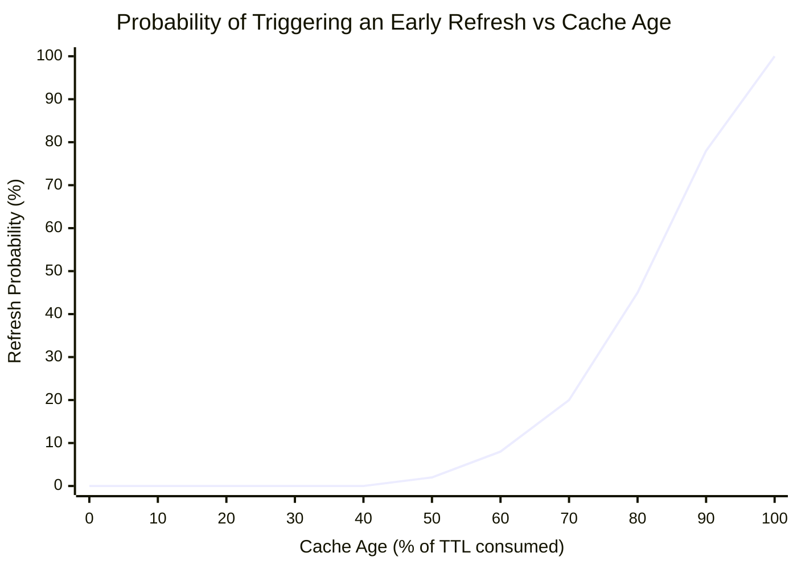

Near the start of a TTL, probability is essentially zero - nobody refreshes fresh data. As the key ages past 50%, probability climbs. By the time you're at 80–90% of TTL, most requests will trigger a refresh. In practice, one of the earliest requests in that window wins, refreshes quietly in the background, and the key gets a fresh TTL before the old one ever expires.

```javascript
function shouldRefreshEarly(cachedAt, ttl, beta = 1.0) {
  const age = (Date.now() - cachedAt) / 1000  // seconds since cached
  const remaining = ttl - age                  // seconds left on TTL

  // XFetch algorithm - used in production at scale
  // As remaining time shrinks, this threshold is easier to exceed
  // beta > 1 = more aggressive early refresh (refresh earlier, more often)
  // beta < 1 = more conservative (refresh closer to actual expiry)
  const score = age - beta * Math.log(Math.random()) * (ttl * 0.1)

  return score > ttl
}

async function getWithPER(key, fetchFn, ttl = 60) {
  const entry = await cache.get(key)

  if (!entry) {
    // Nothing in cache at all - blocking fetch, no way around it
    const data = await fetchFn()
    await cache.set(key, { data, cachedAt: Date.now() }, ttl)
    return data
  }

  if (shouldRefreshEarly(entry.cachedAt, ttl)) {
    // This specific request won the lottery - refresh in background
    // All other concurrent requests just get the cached value as normal
    refreshInBackground(key, fetchFn, ttl)
  }

  return entry.data
}

async function refreshInBackground(key, fetchFn, ttl) {
  try {
    const data = await fetchFn()
    const jitter = ttl * (0.05 + Math.random() * 0.10)
    await cache.set(key, { data, cachedAt: Date.now() }, Math.floor(ttl + jitter))
  } catch (err) {
    // Background refresh failed - not the end of the world.
    // The existing cache entry is still being served.
    // Next request will try PER again.
    console.error(`[PER] Background refresh failed for ${key}`, err)
  }
}
```

Here's what the lifecycle looks like compared to standard TTL expiry:

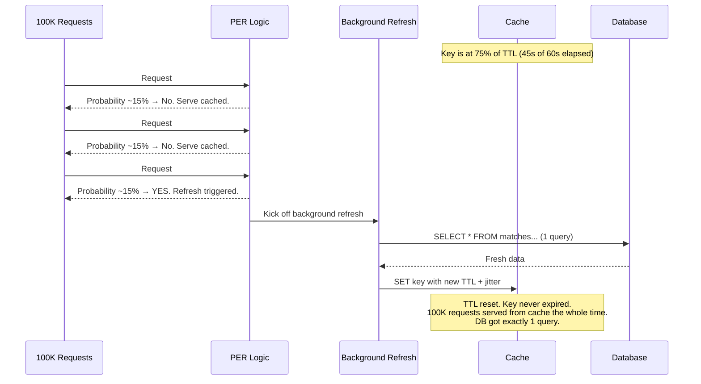

**Why this is better than a simple age threshold like "refresh when 80% consumed":**

A fixed threshold creates its own thundering herd - now all requests that arrive at the 80% mark trigger a background refresh simultaneously. You've just moved the spike earlier in the TTL window, not eliminated it. Randomness is the whole point. PER spreads those early refreshes stochastically across many requests so the DB sees a trickle, never a spike.

The algorithm behind this is called **XFetch**, published in a 2015 paper. It's the mathematically optimal way to decide when to refresh a cache entry early. Redis doesn't implement it natively, but it's a few lines of code to add at your application layer.

**Trade-off:** A small number of requests trigger background refreshes they didn't strictly need to - slightly wasteful on DB queries near the end of a TTL window. In practice, at reasonable traffic levels, the extra queries are negligible compared to the alternative: a synchronized stampede at expiry.

---

### 5. Exponential Backoff with Jitter (Retry Logic)

This one isn't about preventing the first spike. It's about preventing retries from turning a manageable incident into a catastrophe.

When requests time out, client retry logic fires. If every client retries at the same fixed interval - say, "retry after 1 second" - what happens?

They all retry at the same time. You've scheduled a *second* thundering herd, 1 second in the future.

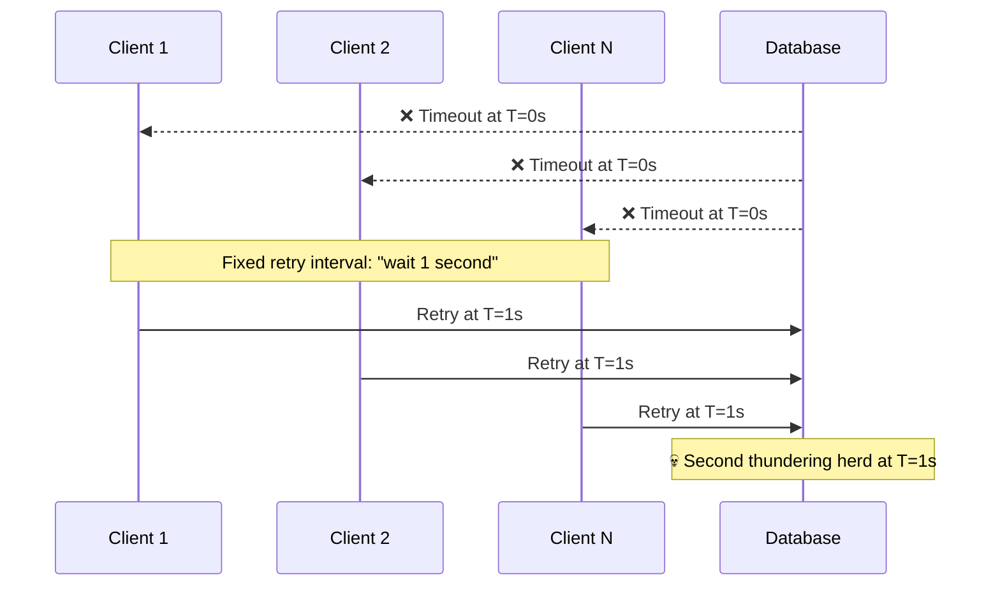

The fix: randomize retry timing. Exponential backoff (wait longer after each failure) plus jitter (randomize the wait) so retries are spread out rather than synchronized.

```javascript
async function fetchWithBackoff(fn, { maxRetries = 4, baseDelay = 200 } = {}) {
  for (let attempt = 0; attempt <= maxRetries; attempt++) {
    try {
      return await fn()
    } catch (err) {
      if (attempt === maxRetries) throw err

      // Exponential: 200ms → 400ms → 800ms → 1600ms
      const exponential = baseDelay * Math.pow(2, attempt)

      // Jitter: add 0–50% random offset so clients don't retry together
      const jitter = Math.random() * exponential * 0.5
      const delay = exponential + jitter

      await sleep(delay)
    }
  }
}
```

```mermaid
gantt
    title Retry Timing: Fixed Interval vs Exponential Backoff with Jitter
    dateFormat s
    axisFormat %Ss

    section ❌ Fixed 1s interval - all retry simultaneously
    Client 1 retry      :crit, 1, 0.1s
    Client 2 retry      :crit, 1, 0.1s
    Client 3 retry      :crit, 1, 0.1s
    Second herd         :crit, 1, 2s

    section ✅ Exponential + Jitter - spread out
    Client 1 first retry      :done, 0.8, 0.1s
    Client 2 first retry      :done, 1.3, 0.1s
    Client 3 first retry      :done, 2.1, 0.1s
    Client 1 second retry     :done, 2.4, 0.1s
    Client 2 second retry     :done, 3.6, 0.1s
```

Braintree (PayPal's payment processor) traced a major outage to exactly this. Failed jobs retried on fixed intervals, stacking perfectly on top of new incoming traffic, overwhelming their services every N seconds like clockwork. Adding jitter broke the synchronization. Problem gone.

---

### 6. Cache Warming

The most powerful technique is making sure the cache is never empty when traffic arrives. If you can predict when a spike is coming, pre-load the cache before it happens.

This is proactive, not reactive - and it's the right instinct when you know the event schedule.

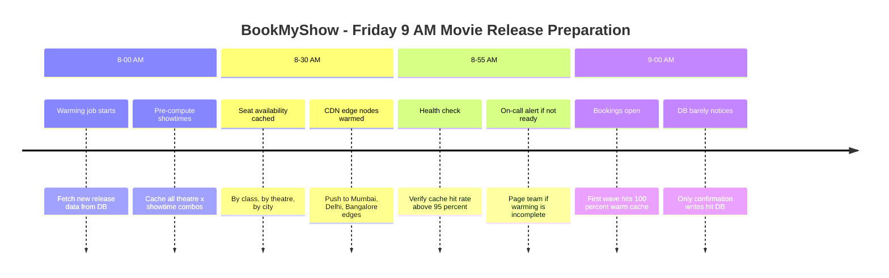

```javascript
class CacheWarmer {
  async warmBeforeEvent({ eventTime, keys }) {
    const warmAt = eventTime - 30 * 60 * 1000  // start 30 min early

    // Fetch in batches - don't DDoS your own DB with 100K parallel queries
    await this.batchFetch(keys, { batchSize: 50, pauseBetween: 200 })

    const hitRate = await this.verifyHitRate(keys)
    if (hitRate < 0.95) {
      alertOnCall(`Warming incomplete - hit rate: ${(hitRate * 100).toFixed(1)}%`)
    }
  }

  async batchFetch(keys, { batchSize, pauseBetween }) {
    for (let i = 0; i < keys.length; i += batchSize) {
      const batch = keys.slice(i, i + batchSize)
      await Promise.all(batch.map(({ key, fetch, ttl }) =>
        fetch().then(data => {
          // Always add jitter to warmed keys too -
          // or you've just moved the thundering herd 1 hour into the future
          const jitter = ttl * (0.05 + Math.random() * 0.10)
          return cache.set(key, data, Math.floor(ttl + jitter))
        })
      ))
      await sleep(pauseBetween)  // breathe between batches
    }
  }
}
```

**The trap that kills warming jobs:** if you fetch all 100K keys in parallel, you've just DDoS'd your own DB from inside your own network. Always batch. Always pause between batches.

IRCTC warms train schedules and fare data from 9:45 AM before the 10 AM Tatkal window. And yet they still struggle at 10 AM - because seat booking *writes* also spike simultaneously. Caching can't help with writes. That's a different problem: distributed locking and optimistic concurrency control.

---

## How the Techniques Layer Together

No single technique covers everything. In production, you combine them based on your situation:

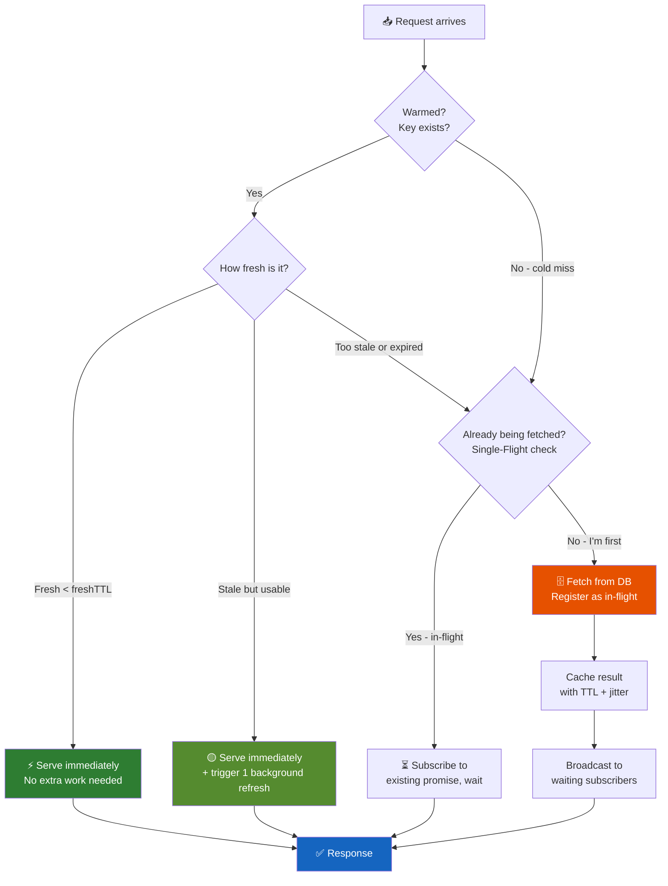

In practice:
- **Cache warming** prevents cold-start misses for known events
- **Jitter** prevents synchronized mass expiry across all keys
- **Single-flight** ensures only one DB query per expired key, no matter how much traffic
- **SWR** means most users never wait even during a background refresh
- **Backoff with jitter** stops retries from compounding into a second wave

You don't need all of them everywhere. A live match score needs SWR + single-flight. A product listing needs jitter + warming. An auth token shouldn't be cached at all.

---

## Real Incidents Worth Learning From

### Facebook 2010 - One Bad Config Value

Facebook's outage wasn't caused by too much traffic. A bad configuration value propagated through every layer of their Memcached infrastructure, causing every cache lookup to fail. Hundreds of millions of requests suddenly had no cache - and their database received raw traffic it had never been designed to handle.

Their core fix was **lease tokens**: when a cache miss happens, the server issues a lease to exactly one request to fetch from the DB. Other requests for the same key receive the token and wait. When the leaseholder writes to cache, it surrenders the lease. It's the single-flight pattern, but built into cache infrastructure itself - so every team doesn't have to reinvent it.

### Instagram - Cache the Promise, Not the Data

Instagram published an elegant solution: instead of caching the *result* of a DB query, cache the *Promise* that represents it. First miss creates a Promise and stores it in cache. Every subsequent request finds the Promise and awaits it. One DB query, zero coordination overhead, and the cache itself becomes the synchronization mechanism - not a separate registry.

### IRCTC - The 10:00:00 AM Wall

Arguably India's most concentrated thundering herd. Tatkal booking opens at exactly 10 AM. Millions of users refresh simultaneously. Seats are scarce. Stakes are real. IRCTC pre-warms train and fare data from 9:45 AM, runs quota logic on in-memory data structures, and uses circuit breakers on booking writes.

And yet they still struggle at 10 AM - because booking *writes* also spike simultaneously, and caching can't help with writes. That's distributed locking and optimistic concurrency control, a different problem entirely.

---

## Choosing the Right Technique

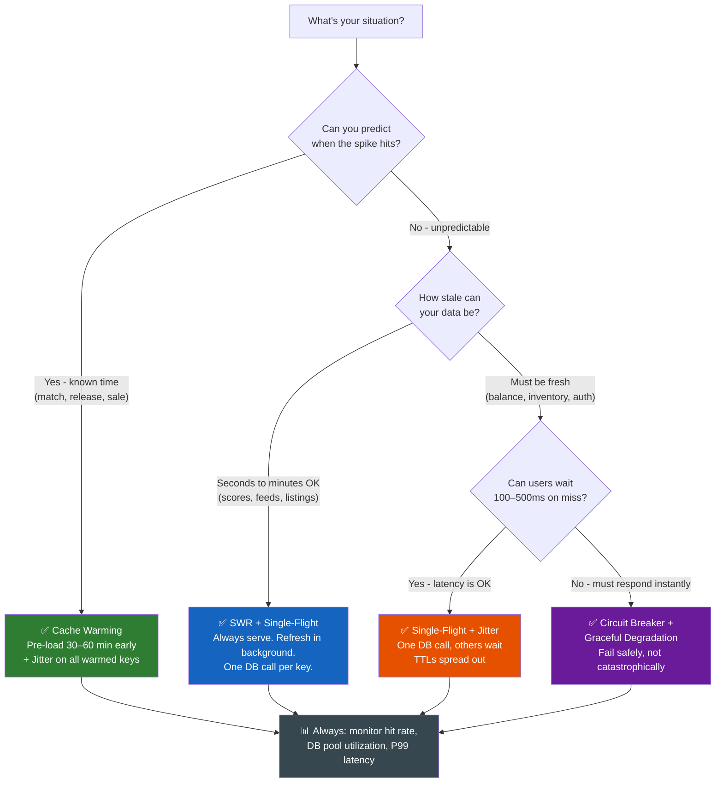

---

## Further Reading

- [Instagram Engineering: Thundering Herds & Promises](https://instagram-engineering.com/thundering-herds-promises-82191c8af57d) - The Promise-caching approach, explained by the people who built it
- [Netflix Tech Blog: Caching for a Global Netflix](https://netflixtechblog.com/caching-for-a-global-netflix-7bcc457012f1) - How they handle cold caches when traffic shifts between regions
- [Braintree/PayPal: Fixing the Retry Storm](https://www.infoq.com/news/2022/05/braintree-thundering-herd/) - Real incident, real fix with exponential backoff + jitter
- [Go's `singleflight` package](https://pkg.go.dev/golang.org/x/sync/singleflight) - Worth reading even if you don't write Go - the abstraction is elegant and clean
- [XFetch: Probabilistic Cache Stampede Prevention](https://cseweb.ucsd.edu/~avattani/papers/cache_stampede.pdf) - The academic paper behind PER (Probabilistic Early Recomputation)
