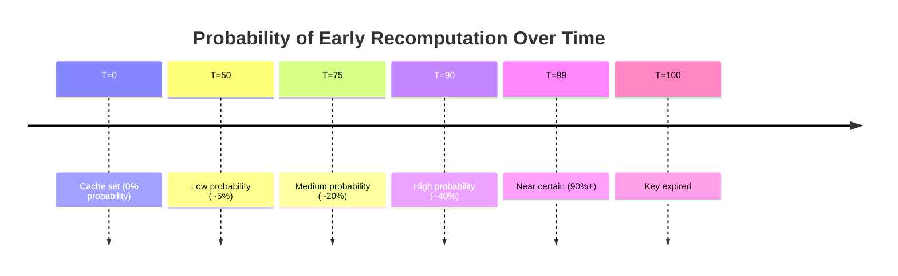
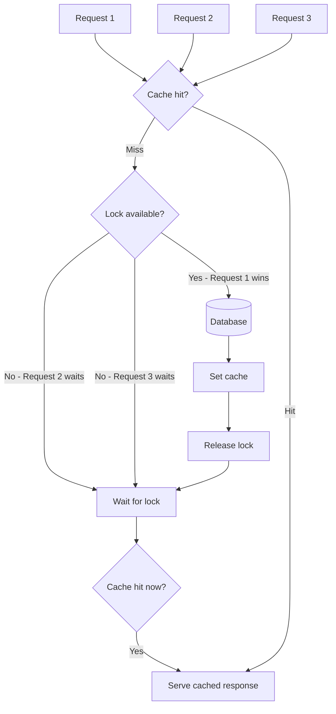
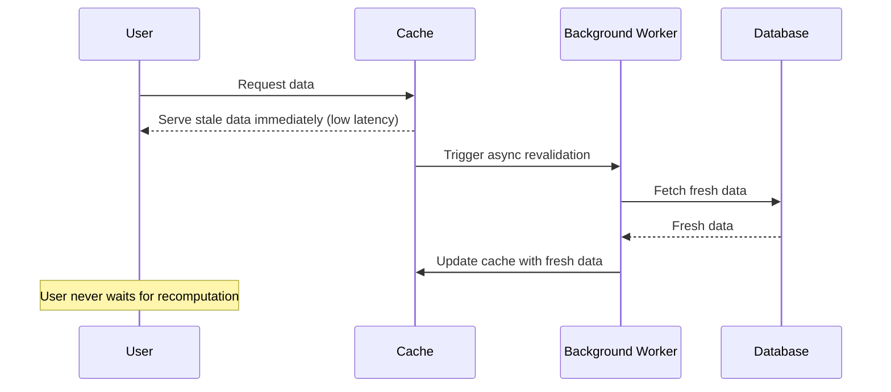
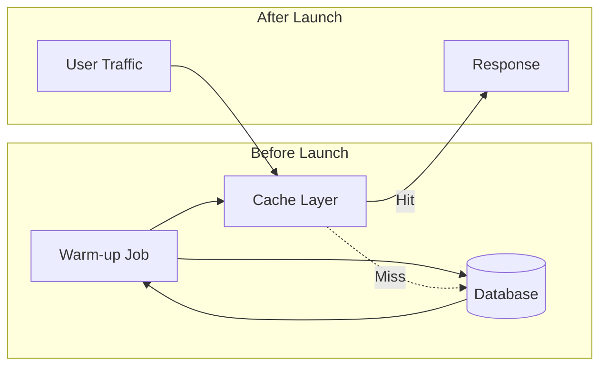
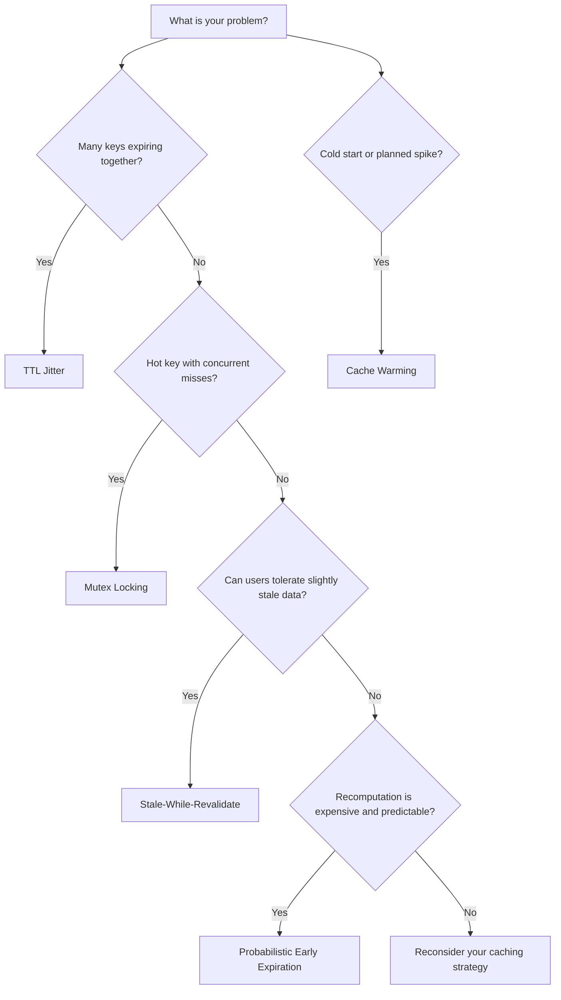

You set a TTL. You feel good about it. Then at 3am, your cache expires and your database gets hit by 50,000 requests simultaneously. Alerts go off. The on-call engineer is not happy.

This is the thundering herd problem, and basic TTL caching doesn't protect you from it. Let's talk about what actually does.

---

## The Problem: Your Cache Keys Are Synchronized

When you cache something, you assign a time-to-live. Say it's 60 seconds. Seems fine. But here's what happens in a high-traffic system:

At second 0, a hundred thousand users visit your homepage. Your cache layer fetches fresh data and stores it. All of those cache entries now have the same TTL. They were all set at the same time.

At second 60, every single one of those keys expires. Simultaneously. Now every request that hits your service finds no cache, and every one of them tries to fetch fresh data from your database at the same moment.

```mermaid
gantt
    title Synchronized TTL Expiry
    dateFormat  ss
    axisFormat %Ss

    section Cache Keys
    Key A (live)    :active, 00, 60s
    Key B (live)    :active, 00, 60s
    Key C (live)    :active, 00, 60s

    section DB Spike
    Mass DB Hit     :crit, 60, 20s
```

Your database, which was happily serving cached traffic, suddenly gets a wall of queries it has not seen since startup. If it can't handle that load, you get cascading failures. Services back up, timeouts propagate, and what started as an expired cache becomes a full incident.

This is not hypothetical. It has taken down real systems. During IPL streaming spikes, during flash sales on Flipkart, during product launches where engineers did not think past "set TTL = 300."

---

## Fix 1: TTL Jitter

The simplest fix. Instead of every key getting the same TTL, you add a small random offset.

```mermaid
gantt
    title Jittered TTL Expiry (spread over time)
    dateFormat  ss
    axisFormat %Ss

    section Cache Keys
    Key A (60s TTL)     :active, 00, 60s
    Key B (67s TTL)     :active, 00, 67s
    Key C (73s TTL)     :active, 00, 73s
    Key D (55s TTL)     :active, 00, 55s

    section DB Load
    Spread DB queries   :55, 20s
```

Instead of `ttl = 300`, you do `ttl = 300 + random(0, 60)`. Now your keys expire at different moments, spreading the database load over a window of time rather than concentrating it in a single instant.

This is low effort, high impact. Almost every distributed caching guide recommends it as a baseline. If you are not already doing this, do it today.

The tradeoff is that some entries stay stale a bit longer than others. For most use cases, that is completely acceptable. For data where freshness matters down to the second, you need something more sophisticated.

---

## Fix 2: Probabilistic Early Expiration

Jitter helps at the population level. But even with jitter, individual keys still expire suddenly. The request that arrives the moment a key expires has to pay the full recomputation cost.

Probabilistic early expiration addresses this differently. Instead of waiting for the key to expire, you start recomputing before it expires, based on probability that increases as the key approaches its TTL.

The mental model: imagine a key that expires at T=100. At T=50, there is a 5% chance any given request will decide to recompute the cache. At T=90, that probability climbs to 40%. At T=99, it is near certain.

The math is straightforward but you do not need to internalise it. The key insight is: you are smoothing the recomputation event from a sharp cliff into a gentle slope. The cache gets refreshed before it expires, by whichever lucky request wins the probabilistic roll.

**Real-world application:** This works well for individual hot keys, not for mass expiry. It is most useful when you have a small number of extremely popular keys that you cannot afford to miss.

---

## Fix 3: Mutex Locking (Cache Stampede Prevention)

Both jitter and probabilistic expiration are about timing. Mutex locking is about concurrency.

Here is the problem it solves: even if only one key expires at a time, when that key is popular, you might have 10,000 requests hitting it simultaneously. All 10,000 find the cache empty. All 10,000 go to the database. That is still a stampede, just a smaller one.

The mutex approach says: only one request is allowed to recompute the cache. Everyone else waits.

Request 1 gets the lock. Requests 2 through 10,000 wait. When Request 1 finishes computing, it sets the cache and releases the lock. Now everyone reads from cache. Your database sees exactly one query instead of ten thousand.

The implementation typically uses Redis SETNX (set if not exists) or a distributed lock library. The tricky part is handling lock timeouts: if Request 1 crashes mid-computation, you do not want the lock held forever.

**The tradeoff here is latency.** All those waiting requests are delayed while Request 1 does its work. For slow recomputations, that can be significant. You need to weigh: is it better to serve all users slightly delayed, or to hammer the database and serve most users at normal speed while the database struggles?

For most cases, the mutex approach wins. Database instability affects everyone anyway.

---

## Fix 4: Stale-While-Revalidate

This is arguably the most elegant solution, and it is how CDNs have worked for decades.

The idea: serve the stale value immediately, then recompute in the background.

You define two TTLs. One is the "fresh" TTL. One is the "stale" TTL. Within the fresh window, serve normally. Within the stale window (after fresh expiry but before stale expiry), serve the old value to the user but kick off a background job to refresh it. After the stale window, the key is truly gone and you fall back to a blocking fetch.

Netflix uses this pattern extensively. When you load the home screen, you are often seeing data that is a few seconds old. But the page loads instantly because Netflix is not waiting for a fresh API call before rendering. In the background, the cache is silently updating for your next page load.

The tradeoff is consistency. Users can see slightly stale data. For user-generated content or pricing, this might be unacceptable. For recommendation carousels or trending lists, it is completely fine and significantly better for the user experience than a spinning loader.

**SWR** (the React library) is named after this pattern. The same principle applies at the browser caching layer, the CDN layer, and the application cache layer.

---

## Fix 5: Cache Warming

Sometimes the problem is not expiry management. It is a cold start.

You deploy a new service. Cache is empty. Every request is a cache miss. Your database, suddenly the only thing handling traffic, buckles under load it was not designed to handle alone.

Or you have a scheduled maintenance window. Cache gets flushed. Traffic resumes before the cache is rebuilt. Same problem.

Cache warming is the practice of proactively populating the cache before traffic arrives.

In practice, this means running a script before a product launch that fetches all the data users are likely to request and pre-populates the cache. At IPL stream start, you want the match schedule, player stats, and video manifests already cached before a hundred million people open the app.

For e-commerce sales, you warm the cache with product details, inventory counts, and pricing for every item in the sale catalogue before the sale goes live. When 11pm hits and the sale opens, the first request serves from cache.

The challenge is knowing what to warm. You need enough production data or traffic modelling to predict the hot keys. A warming job that misses the most popular keys is not much better than no warming at all.

---

## Putting It Together: When to Use What

Here is the short version of when to reach for each strategy:

**TTL Jitter** is your default baseline. Add it to everything. The cost is near zero and the benefit is real. If you are not using it, your system is an incident waiting to happen.

**Stale-While-Revalidate** is right for most data. User-facing features where freshness can be measured in seconds rather than milliseconds are good candidates. Recommendation engines, trending content, non-real-time dashboards.

**Mutex Locking** is for high-concurrency hot keys. When a single key missing translates to thousands of simultaneous database queries, you need a lock. Combine it with SWR for best results.

**Probabilistic Early Expiration** is for situations where you want a single hot key to stay warm continuously. It is lower concurrency than mutex locking but more proactive.

**Cache Warming** is an operational concern. Build it into your deployment runbook, your incident playbook for cache flushes, and your load testing strategy.

---

## The Real Tradeoff Matrix

Every strategy here involves a choice between three competing concerns: freshness, latency, and database load.

| Strategy | Freshness | Latency | DB Protection |
|---|---|---|---|
| Basic TTL | High | Low (on hit) | None |
| TTL Jitter | High | Low (on hit) | Moderate |
| Probabilistic Early Expiry | High | Low | Good |
| Mutex Locking | High | Slightly higher on miss | Excellent |
| Stale-While-Revalidate | Medium | Always low | Excellent |
| Cache Warming | High initially | Always low | Excellent |

There is no universal answer. A payment processing service has different requirements than a content recommendation service. The right combination depends on what your users actually care about.

But here is what I have noticed after seeing a few systems fail under load: most teams reach for basic TTL because it is simple, and then do nothing else until something breaks. The time to add jitter and stale-while-revalidate is not during an incident. It is when you first build the caching layer.

Your cache is not just a performance optimisation. It is a load-bearing component of your system. Treat it that way.

---