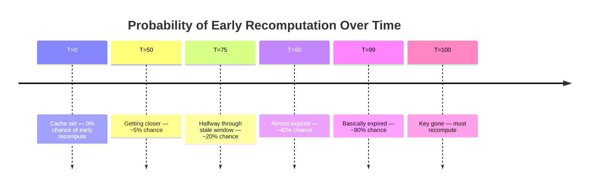
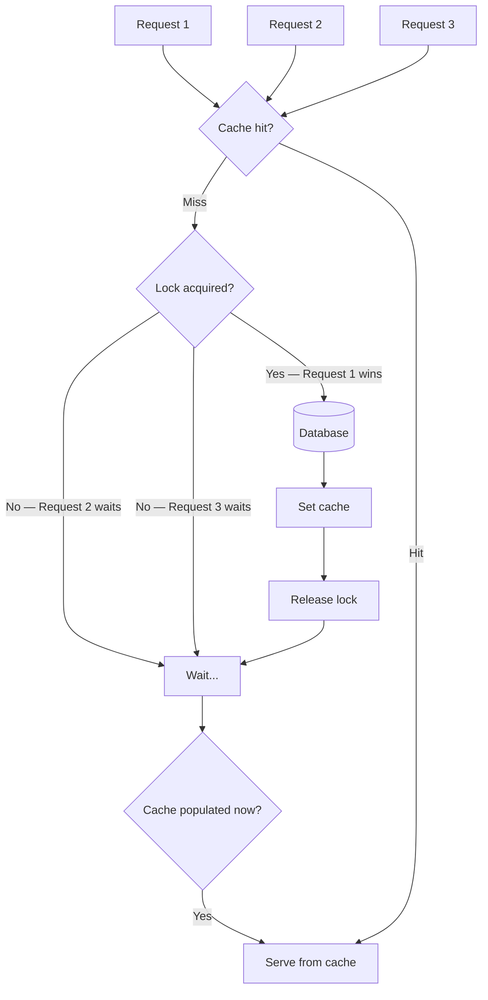
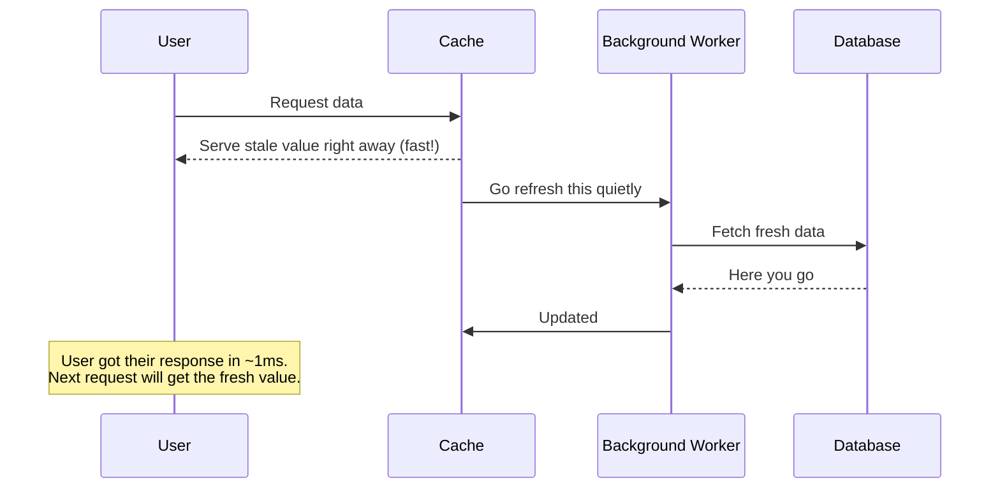
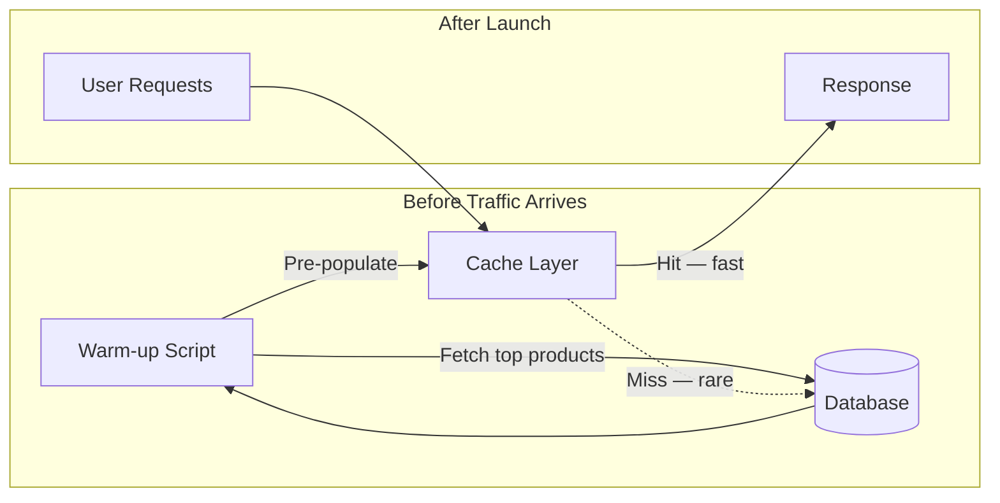
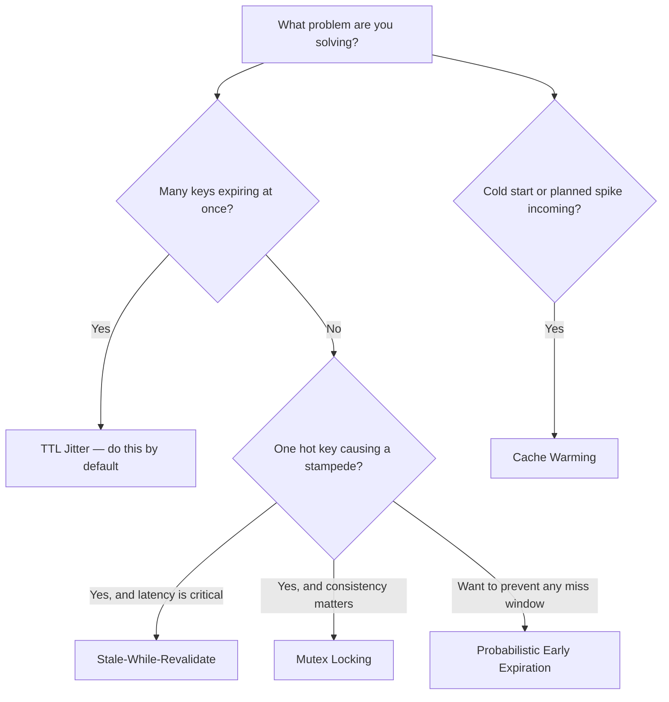

# When Your Cache Expires, Your Server Dies

You set a TTL. You feel good about it. You ship it.

Then at 3am, your cache expires and your database gets hit by 50,000 requests at the same time. Alerts go off. The on-call engineer wakes up. Slack is on fire.

This is the thundering herd problem. And basic TTL caching does not protect you from it. Let us talk about what actually does, one strategy at a time.

---

## First, What Actually Goes Wrong?

When you cache something, you give it a time-to-live. Say 60 seconds. Seems fine.

But here is the subtle trap: in a high-traffic system, many users hit your service at the same time. Your cache fills up with entries that were all set at roughly the same moment. Which means they all expire at roughly the same moment too.

```text
Time (sec) | 00        15        30        45        60        75
-----------------------------------------------------------------
Cache Keys |
Key A      |[=======================================] (expires)
Key B      |[=======================================] (expires)
Key C      |[=======================================] (expires)
           | 
DB Load    |                                         ⚠️ DB Stampede
```

At second 60, every key is gone. Every request that arrives finds an empty cache. Every single one of them goes straight to your database. Your database, which was handling maybe 10 queries per second (because 99% of traffic was cached), is now handling 50,000 queries per second. It cannot keep up. Timeouts start. Services back up. What began as a cache expiry becomes a full outage.

This is not a theoretical edge case. It has taken down real systems. IPL streaming on launch day. Flash sales on e-commerce platforms. Product launches where no one thought past "set TTL = 300."

Here is what basic caching looks like, and why it sets you up for this problem:

```js
// The naive approach that most people start with
const getUser = async (userId) => {
  const cached = await cache.get(`user:${userId}`)
  if (cached) return JSON.parse(cached)

  const user = await db.query('SELECT * FROM users WHERE id = ?', [userId])

  // Every key gets the exact same TTL.
  // If a thousand users sign up at the same time,
  // all their cache entries expire at the same time.
  await cache.set(`user:${userId}`, JSON.stringify(user), 'EX', 300)

  return user
}
```

There is nothing obviously wrong with this code. But at scale, it is a time bomb. Let us fix it.

---

## Fix 1: TTL Jitter

This is the simplest fix and honestly you should just always do it. The idea is to stop giving every key the exact same TTL. Add a small random offset so keys expire at slightly different times.

```text
Time (sec) | 00        15        30        45        60        75
-----------------------------------------------------------------
Cache Keys |
Key A      |[==================================] (expires at 55s)
Key B      |[=======================================] (expires at 60s)
Key C      |[=============================================] (expires at 67s)
Key D      |[===================================================] (expires at 73s)
           | 
DB Load    |                                   ✅ Queries spread out
```

Instead of a spike at second 60, you get a gentle trickle of cache misses spread over 15 to 20 seconds. Your database handles it comfortably.

```js
// Add a random jitter to spread out expiry times
const withJitter = (baseTtl, jitterRange = 60) => {
  return baseTtl + Math.floor(Math.random() * jitterRange)
}

const getUser = async (userId) => {
  const cached = await cache.get(`user:${userId}`)
  if (cached) return JSON.parse(cached)

  const user = await db.query('SELECT * FROM users WHERE id = ?', [userId])

  // Instead of always 300s, keys now expire anywhere between 300-360s.
  // Not all at once. Problem largely solved with two lines of code.
  const ttl = withJitter(300, 60)
  await cache.set(`user:${userId}`, JSON.stringify(user), 'EX', ttl)

  return user
}
```

The only tradeoff: some entries stay stale a little longer than others. For most use cases, that is completely fine. If you need data fresh to the exact second, you need something stronger, but jitter alone handles the vast majority of real-world cache stampede scenarios.

**Do this everywhere. Today. It costs almost nothing.**

---

## Fix 2: Probabilistic Early Expiration

Jitter spreads expiry across a population of keys. But what about a single very hot key? If your homepage hero banner is cached under one key, and that key gets 20,000 requests per second, even a jittered expiry is going to cause a painful spike the moment it expires.

Probabilistic early expiration solves this differently. Instead of waiting for the key to expire, some requests start recomputing it early. The closer the key is to expiring, the more likely any given request will trigger a background refresh.



You do not need to understand the maths to use this pattern. The intuition is: the closer a key is to dying, the more aggressively the system tries to refresh it before it actually dies.

```js
// `delta` controls how eagerly we recompute before expiry.
// Higher delta = more eager. Start with 1 and tune from there.
const shouldRecomputeEarly = (remainingTtl, computationTime, delta = 1) => {
  // As remaining TTL shrinks, this probability grows toward 1.
  // When the key still has plenty of time left, this almost never fires.
  const probability = Math.exp(-remainingTtl / (computationTime * delta))
  return Math.random() < probability
}

const getHotKey = async (key, fetchFn, ttl = 300) => {
  // Assumes cache.getWithTtl returns { value, remainingTtl } or null
  const cached = await cache.getWithTtl(key)

  if (cached) {
    const estimatedComputeTime = 0.1 // ~100ms to recompute, in seconds

    if (shouldRecomputeEarly(cached.remainingTtl, estimatedComputeTime)) {
      // This request "wins the lottery" and refreshes the cache proactively.
      // The user still gets the cached value instantly — no latency hit.
      fetchFn()
        .then((fresh) => cache.set(key, JSON.stringify(fresh), 'EX', ttl))
        .catch((err) => console.error('Early recompute failed:', err))
    }

    return JSON.parse(cached.value)
  }

  // True cache miss — fetch and store normally
  const value = await fetchFn()
  await cache.set(key, JSON.stringify(value), 'EX', ttl)
  return value
}
```

The user always gets a fast response. The recomputation happens in the background. And because it starts before the key actually expires, you almost never get a true cache miss on a hot key.

This is great for a small number of extremely popular keys. It does not replace jitter for the general case.

---

## Fix 3: Mutex Locking

Jitter and probabilistic expiration are both about timing. Mutex locking is about concurrency.

Here is the scenario: one key expires. It is a popular key. In the gap between "key expired" and "key refreshed," you have 5,000 requests all trying to recompute it at the same time. That is 5,000 database queries for the exact same data, all running in parallel.

Mutex locking says: only one request is allowed to do the work. Everyone else waits.



Request 1 grabs the lock and does the work. Requests 2 through 5,000 wait patiently. When Request 1 finishes, it writes to cache and releases the lock. Everyone else reads from cache. Your database sees exactly one query instead of five thousand.

```js
const LOCK_TTL = 10 // seconds — safety net in case the winner crashes mid-fetch

const getWithMutex = async (key, fetchFn, cacheTtl = 300) => {
  const cached = await cache.get(key)
  if (cached) return JSON.parse(cached)

  const lockKey = `lock:${key}`

  // SETNX = "set if not exists". Only one request wins this.
  // The 'NX' flag makes this atomic — no race conditions.
  const lockAcquired = await cache.set(lockKey, '1', 'EX', LOCK_TTL, 'NX')

  if (lockAcquired) {
    try {
      // We won the lock. Do the expensive work.
      const value = await fetchFn()
      await cache.set(key, JSON.stringify(value), 'EX', withJitter(cacheTtl))
      return value
    } finally {
      // Critical: always release the lock, even if fetchFn throws.
      // Without this, the lock stays until LOCK_TTL expires.
      await cache.del(lockKey)
    }
  }

  // We did not get the lock. Wait briefly, then retry.
  // By the time we retry, the winner should have populated the cache.
  await sleep(100)
  return getWithMutex(key, fetchFn, cacheTtl)
}

const sleep = (ms) => new Promise((resolve) => setTimeout(resolve, ms))
```

The tradeoff is that waiting requests take slightly longer. If your recomputation takes 500ms, every waiting request is delayed by roughly 500ms. For most systems, that is acceptable. A short delay beats your database going down.

One thing to pay close attention to in the code above: the `finally` block. If your fetch function throws, you still need to release the lock. Without that, the lock stays held until `LOCK_TTL` expires, and no request can refresh the cache in that window.

---

## Fix 4: Stale-While-Revalidate

This is probably the most elegant strategy, and it is how CDNs have operated for decades.

The idea is beautifully simple: serve the old value immediately, then recompute in the background.



You define two TTLs. The "fresh" TTL is how long the data is considered current. After that, you enter a "stale" grace period: the data is old, but you still serve it while you refresh in the background. After the stale window ends, the key is truly gone and you fall back to a blocking fetch.

```js
const SWR_CONFIG = {
  freshTtl: 60,   // serve normally for 60 seconds
  staleTtl: 300,  // serve stale for up to 5 more minutes while refreshing in background
}

const getWithSWR = async (key, fetchFn) => {
  const entry = await cache.get(key)

  if (entry) {
    const { value, cachedAt } = JSON.parse(entry)
    const ageInSeconds = (Date.now() - cachedAt) / 1000

    if (ageInSeconds < SWR_CONFIG.freshTtl) {
      // Still fresh. Just return it.
      return value
    }

    if (ageInSeconds < SWR_CONFIG.staleTtl) {
      // Stale, but within the grace period.
      // Return the old value immediately, refresh in the background.
      fetchFn()
        .then((fresh) =>
          cache.set(
            key,
            JSON.stringify({ value: fresh, cachedAt: Date.now() }),
            'EX',
            SWR_CONFIG.staleTtl
          )
        )
        .catch((err) => console.error('SWR background refresh failed:', err))

      return value // user gets this instantly — no waiting at all
    }
  }

  // True miss or fully expired. Block and fetch.
  const fresh = await fetchFn()
  await cache.set(
    key,
    JSON.stringify({ value: fresh, cachedAt: Date.now() }),
    'EX',
    SWR_CONFIG.staleTtl
  )
  return fresh
}
```

Netflix does this constantly. When you open the app, you are probably seeing data that is a few seconds old. But the page loads instantly. In the background, your recommendations are silently being refreshed for the next time you scroll.

The `SWR` React library is named after this exact pattern. Same concept, applied to client-side data fetching.

The tradeoff is data freshness. Users can see slightly stale data. For inventory counts or live pricing, this is probably a bad idea. For trending lists, recommendation carousels, or user profiles, it is a great trade. Fast experience, invisible updates, almost no stale data in practice.

---

## Fix 5: Cache Warming

The previous four strategies all deal with expiry management. This one is about a completely different problem: what happens when your cache is empty to begin with?

You deploy a new version of your service. Cache is cold. Every request is a miss. Your database, which normally handles 2% of traffic (because 98% is cached), is suddenly handling 100% of it. It was not provisioned for that. Services degrade. Users notice.

Or you run a planned maintenance window. Cache gets flushed. Traffic resumes before the cache rebuilds. Same problem.

Cache warming is the practice of proactively populating the cache before traffic arrives.



```js
// Run this as part of your deployment pipeline,
// before you route live traffic to the new instance.

const warmCache = async () => {
  console.log('Starting cache warm-up...')

  // Pre-load the top 1000 most-viewed products based on historical data
  const topProducts = await db.query(
    'SELECT id FROM products ORDER BY view_count DESC LIMIT 1000'
  )

  // Process in batches so we do not hammer the DB ourselves
  const batchSize = 50

  for (let i = 0; i < topProducts.length; i += batchSize) {
    const batch = topProducts.slice(i, i + batchSize)

    await Promise.all(
      batch.map(async ({ id }) => {
        const product = await db.query('SELECT * FROM products WHERE id = ?', [id])

        // Add jitter even here — so warm keys do not all expire together later
        const ttl = withJitter(3600, 300)
        await cache.set(`product:${id}`, JSON.stringify(product), 'EX', ttl)
      })
    )

    console.log(`Warmed ${Math.min(i + batchSize, topProducts.length)} / ${topProducts.length}`)
  }

  console.log('Cache warm-up complete. Ready for traffic.')
}

warmCache()
```

For an IPL match day, you warm the match schedule, player profiles, and video stream metadata before the match starts. For a midnight flash sale, you warm the entire sale catalogue an hour before it goes live. When the spike hits, the cache is already full and your database barely notices.

The challenge is knowing what to warm. Use your analytics. If you are warming 1,000 products but the top 10 drive 80% of traffic, you absolutely need to get those top 10 right. If you do not have production data yet, warm broadly and tighten it as you learn.

---

## When to Reach for What



Quick rules of thumb:

**Always add TTL jitter.** It is a two-line change and it prevents an entire class of problems. No reason not to.

**Stale-While-Revalidate** is the right default for most user-facing data. Fast responses, invisible refreshes, happy users. Use it for anything where data does not need to be realtime.

**Mutex locking** is for high-concurrency hot keys where you cannot serve stale data. Pair it with jitter on the cache TTL when you set the refreshed value.

**Probabilistic early expiration** is more niche. Reach for it when you have a few extremely hot keys and want to keep them continuously warm with no visible miss window.

**Cache warming** is operational. Put it in your deployment checklist. Run it after any cache flush. Build it into your incident runbook.

---

## The Tradeoff Table

Every strategy makes a different bet on freshness vs latency vs safety.

| Strategy | Freshness | Latency | DB Protection |
|---|---|---|---|
| Basic TTL | High | Low (on hit) | None |
| TTL Jitter | High | Low (on hit) | Moderate |
| Probabilistic Early Expiry | High | Low | Good |
| Mutex Locking | High | Slightly higher on miss | Excellent |
| Stale-While-Revalidate | Medium | Always low | Excellent |
| Cache Warming | High initially | Always low | Excellent |

There is no universally correct answer. A payments service and a recommendation engine have very different requirements. The right combination depends on what your users actually feel and what your database can actually handle.


---

